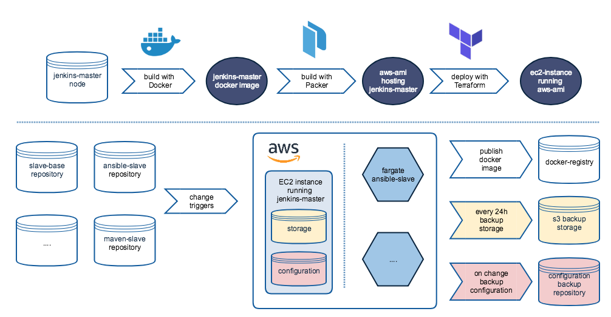

# Disaster Recovery Day

Wir Entwickler bei Ideas glauben fest an das Mantra ["You build it, you run it"](https://queue.acm.org/detail.cfm?id=1142065). Auch wenn der von Amazons Chief Technology Officer Werner Vogel Spruch mitlerweile mehr als 12 Jahre als ist, beschreibt es immer noch genau die DevOps Kultur die wir hier leben. Neben DevOps gehört der "agile" Gedanke von kontinuierlicher Verbesserung und schnellem Feedback zu unser täglichen Arbeit.

Beim Entwickeln von Software geben uns Test schnelles Feedback. Unser Continious-Intergrations-System sendet bei der fehlgeschlagenen Integration Chat- und Email-Nachrichten. Doch was ist mit dem Testen der Build-Infrastruktur, die für moderne Software-Entwicklung nötig ist?   

Um diese Frage klar beantworten zu können, hat sich das Team Enterprise entschieden einen "Disaster-Recovery" Tag durchzuführen. 

- DevOps Kultur 
- Theoretisches Wissen erproben
- Wissenssilos vermeiden
- Wissenlücken identifizieren und ggf. schließen
- Kontinuierlich besser werden
- Sicheres Gefühl im Umgang mit unserem BUILD Setup

## CI/CD Done by team Enterprise

Das Team Enterprise betreut eine größere Software-Platform namens "ContentPool", die aus einem Dutzend Services besteht. Jeder Service hat sein eigenes Repository. Unser CI/CD System [Jenkins](https://jenkins.io/) lauscht auf Änderungen in den Repositories und startet die Deployment-Pipeline. Die hohe Testabdeckung gibt uns das Vertrauen jede noch so kleine Änderung automatisch von Jenkins auf Produktion ausrollen zu lassen. Die Integration von Jenkins in unsere Team-Kommunikation durch Mail, HipChat, Slack und Jira gibt uns die nötige Sichtbarkeit. 

Die Pipeline für jeden Service besteht aus folgenden Schritten:
 * __Test & Build__: Jenkins führt die Unit- und Integrationstests der Anwendung aus und veröffentlicht ein neues Artefakt bei Artifactory.
 * __Deploy & run end2end:__ Das neue Artefakt wird bei Heroku auf der End2End Stage deployed und danach die End2end Test ausgeführt. 
 * __Deploy integration__: Wenn die End2End Test erfolgreich passiert wurden, wird die Anwendung in den Integrationsumgebung deployed. 
 * __Deploy production__: Nach dem deployment auf der Integrations-Stage wird die Anwendung in die Produktionsumgebung deployed. 

Wie in jeder anderen Firma auch, kommen und gehen Kollegen. Auch hat sich unsere Firmenstruktur von dedizierten Silo-Teams hin zu cross-funktionalen Teams verändert. Der vom Team Enterprise betreute Jenkins existierte zum Beispiel schon vor der Team Enterprise Gründung. Damals wurde der Jenkins von einem dedizierten Operations-Team betreut. 

Während der letzten Monate haben wir schrittweise unser Wissen über Jenkins, dem Slave-Setup, die Provisionierung und die wie Ausführung auf AWS als EC2 Instanzen genau funktioniert aufgefrischt. In Form von ["technischen User Stories"](http://rgalen.com/agile-training-news/2013/11/10/technical-user-stories-what-when-and-how) haben wir in jedem Sprint technische Schuld abgebaut und im Gegenzug fehlenden Wissen aufgebaut. 

## Jenkins Setup in great Detail

Jenkins selbst kann als ["Docker-Container"](https://github.com/jenkinsci/docker/blob/master/README.md) in wenigen Minuten zum Laufen gebracht werden. Für einen produktiven Einsatz reicht diese eine Instanz natürlich nicht aus. 

Unser Jenkins-Setup besteht aus einem Master-Node und mehreren Slaves die je nach Bedarf hochgefahren werden. Der Jenkins-Master selbst läuft ständig auf einer dedizierten AWS EC2 Instanz mit einem von uns gebautem AMI. Die Slaves hingegen sind von uns provisionierte Docker-Container welche bei AWS als ["Fargate-Container"](https://aws.amazon.com/de/fargate/) bei Bedarf gestartet werden. 

Das Bauen des Master-Nodes konfigurieren wir über Packer. Die Provisionierung von der EC2 Instanz übernimmt Terraform. Für das Bauen und Veröffentlichen von den Slaves existieren Jenkins-Jobs die vom Master ausgeführt werden. Die neu gebauten Slave-Images werden in Amazons Container-Registry veröffentlicht. Fargate zieht sich die aktuellsten Images wodurch die Slaves immer auf dem aktuellsten Stand sind. Analog zu dem Deployment von einzelnen Services hat auch der Master und jeder Slave ein eigenes Repository. Wir haben uns entschieden für jeden Deployment-Usecase einen dedizierten Slave zu bauen. So existiert ein Maven-Slave für das bauen von Java Applikationen oder eine Heroku-Slave, welcher für das Deployment des Artefakts auf Heroku vorgesehen ist. 

Ohne spezielle Konfiguration sowie eine Unmenge an Plugins könnten wir Jenkins nicht verwenden. Diese Konfiguration wird bei jeder Änderung (hint: über ein weiteres Jenkins-Plugin) in ein Backup-Repository geschrieben. Damit wir die Historie über schon gelaufene Jobs nicht verlieren wird die physische (soweit man bei AWS von einer physischen Platte sprechen kann) über einen Script (TODO: LINK zum REPO) auf einem S3 Bucket nächtlich gespeichert.   

- Tools: JenkinsFiles, Docker, AWS ECS/Fargate, Packer, Terraform, Heroku-CLI

# D(isaster)-Day - Jenkins ist kaputt

Wir waren uns alle sicher, dass trotz des Wissenstransfers das CI System unsere größte Schwachstelle ist. Ohne CI System können wir keine Änderungen in Produktion nehmen und wären damit handlungsunfähig. Was passiert also, wenn eines Morgens Jenkins nicht mehr funktioniert? 

In Absprache mit Kollegen und unserer Produkt-Ownerin, war es dann soweit. Jenkins funktionierte nicht mehr...

- Preparation: Chaos monkey macht alles kaputt (unbeteiligt, nicht Ansprechbar im HO verschwunden)
- 9.30 Jenkins ist aus
ec2 instance is dead
dns record was missing
wrong ami?

10:20 jenkins toolbelt repo 
packer to build ami and deploy it to amazon

10:40 what did packer do?
correct efs, we deleted original backup

10:41 jenkins is alive (but not data)

11:00 Coffee
terraform rename fail, name mismatch confusion, aws termination protection?

12:00 where is the jenkins backup?
s3 bucket downloading / s3 python backup script

12:15 Lunch

13:00 restore script done?
docker efs mount fail
efs is sooo slow
s3 script fail
tar manual

18:00 let's go home

9:00 backup is alive
jenkins pid results in "already instance running" -> manual restart

10:00 DONE

## What we've learned 

Erleben zu können, wie ein Team gemeinsam ohne viel Aufregung ein Problem professionell löst ist unbezahlbar. Die Wiederherstellung vom Jenkins war ein solches Erlebnis. Auch wenn wir das angepeilte Ziel von 3 Stunden mehr als nur verfehlt haben, lief der Jenkins am nächsten Tag verlässlich!

Trotz der ausführlichen Dokumentation währen der letzten Monate hatten sich immer noch einige Lücken aufgetan. Diese wurden während der Übung ergänzt. Wichtige Todos, die im Laufe des Tages uns eingefallen sind, wurden sofort aufgeschrieben und als technische Story in unser Backlog aufgenommen.

- document your steps and create action items on the fly
- untar takes longer than tar
- do not backup logs/workspaces/* (keep backups small, network and i/o is slow and expensive)
- name your instances according to purpose
- test your backup (and restore) solution before disaster happens
- do it again (and again)
- plan your disaster day and inform management

## And now?
- Wir haben vertrauen in unsere Lösung gewonnen
- Wir haben Wissenslücken identifiziert und geschlossen
- Disaster? No disaster!
- Mehr automation? Or less? 
