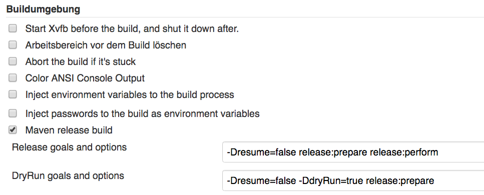

Automatisierte Updates von Versionen in Maven mittels Jenkins
=============================================================

_Technische Lösung: Michail Plushnikov_

_Umgebung: https://updates.jenkins-ci.org/download/war/1.642.1/jenkins.war_

Einer der Vorteile von Maven ist, eine einheitliche Verwendung von Bibliotheken auf Projektebene sicherzustellen. Ändern sich jedoch Versionen von Bibliotheken sehr häufig, dann müssen diese oft von Hand nachgepflegt werden.

Unser Anwendungsfall ist eine Architektur, in der es eine Zahl eigener Komponenten, sowie eigene Bibliotheken gibt, die in diesen Komponenten als Maven Dependencies konfiguriert sind. Wurde nun eine dieser Bibliotheken released, musste die erstellte Versions händisch in den pom.xml Dateien der Komponenten nachgetragen werden. Bei einer sehr aktiven Entwicklung von Bibliotheken hat man oft neue Releases und musste diese bislang häufig selbst eintragen.

Der erste Schritt zur Vereinfachung dieses Ablaufs war, diese Bibliotheksversionen als Property Elemente in der Parent Pom zu pflegen, die von allen Komponenten eingebunden wird.

<properties>
<!--My-Dependencies-->
<my-lib-a.version>2.12</my-lib-a.version>
<my-lib-b.version>1.2</my-lib-b.version>
</properties>

In der Komponente selbst, wird die benötigte Abhängigkeit dann mit der geerbten Version konfiguriert.

<dependency>
    <groupId>de.my.libraries</groupId>
    <artifactId>my-lib-a</artifactId>
    <version>${my-lib-a.version}</version>
</dependency>

Dies reduziert die Stellen an der die jeweilige Version gepflegt werden muss auf eine.

Im nächsten Schritt soll dieser Eintrag automatisiert erstellt werden. Voraussetzung hierfür, ist die Einbindung des [M2 Release Plugin](https://wiki.jenkins-ci.org/display/JENKINS/M2+Release+Plugin)  in der Jenkins CI. In der Jenkins Job Konfiguration der Bibliothek werden sowohl die Release Builds, als auch sogenannte Dry Runs (Builds ohne Erstellung eines neuen Releases) wie folgt, konfiguriert.

Nach einem Release Build wollen wir den Build des Parent Pom Projektes mit der Information, welche Abhängigkeit eine höhere Version erhält, triggern.

Daher müssen wir die Unterscheidung treffen, ob es sich um einen Release Build handelt. Hierzu wird das [Conditional BuildStep Plugin](https://wiki.jenkins-ci.org/display/JENKINS/Conditional+BuildStep+Plugin) eingesetzt und wie folgt konfiguriert.  Unbedingt zu beachten ist, dass der Wert des Parameters _updateVersionPropertyName_ dem Property Eintrag in der Parent Pom entspricht; in unserem Beispiel ist das _my-lib-a.version. _Den Wert des Parameters _updateVersionPropertyValue_ setzen wir mit der bereits vorbelegten Variable $MVN\_RELEASE\_VERSION.

Im getriggerten Build Job müssen wir zunächst sicher stellen, dass diese beiden Parameter zur Ausführung verfügbar sind. Folgend wird die Konfiguration als Text-Parameter des Jobs gezeigt.

Vor dem eigentlichen Build Job wollen wir nun den fraglichen Eintrag der Parent Pom aktualisieren.  Hierzu benötigen wir einen Pre-Build-Schritt.

Wir benutzen abermals das Conditional BuildStep Plugin um anhand des Matching der beiden Textparameter zu entscheiden, ob wir die Pom modifizieren wollen.

Das tatsächliche Überschreiben der POM Version erreichen wir durch die Ausführung eines Bash Snippet über einen Shell Builder der im Conditional Step konfiguriert wird.

Er enthält die folgenden Schritte:

1.  mittels sed in der _pom.xml_ den Property Eintrag mit _<$updateVersionPropertyName>_  identifizieren und die dortige Version durch den übergebenen Wert von _$updateVersionPropertyValue_ ersetzen.
2.  die lokale git Konfiguration auf der Jenkins CI bearbeiten und dort einen berechtigten Benutzer und seine Email eintragen
3.  die Konfiguration pushen
4.  die geänderte Parent Pom adden und mit entsprechender Message committen
5.  die Änderung pushen

echo "Replacing $updateVersionPropertyName with new value $updateVersionPropertyValue"
sed -i -e "/<properties>/,/<\\/properties>/ s|<$updateVersionPropertyName>\[0-9.\]\\{1,\\}</$updateVersionPropertyName>|<$updateVersionPropertyName>$updateVersionPropertyValue</$updateVersionPropertyName>|g" pom.xml

git config --global user.name "My Jenkins‚user"
git config --global user.email my-jenkins-user@host.tld
git config --global push.default simple

git commit -a -m "Updated version for $updateVersionPropertyName to new value $updateVersionPropertyValue"
git push --set-upstream origin master

Der Build baut jetzt mit der aktualisierten Version in der Parent Pom.
