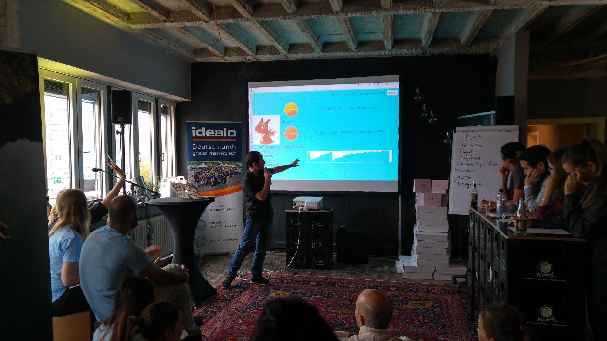

Hack like a girl
================

Und wieder ein weiterer Hackathon, dieses mal waren wir aber als Firma, Sponsor und als Mentoren dort: Der von den Geek Girls Carrots veranstaltete “hack like a girl”. Natürlich auch für Männer. Es geht ja um Inklusion, nicht Exklusion. Insgesamt waren etwa 42 Teilnehmerinnen hier, darunter auch eine Handvoll Männer. Das Thema: Health & Fitness. Gastgeber war Axel Springer, wir haben den Unternehmerclub (ein Penthouse in der Nähe vom Judischen Museum) für die teilnehmenden IT-Nachwuchskräfte zur Verfügung gestellt.

Eigentlich fast die ganze Zeit waren auch zwei Hunde von Teilnehmern vor Ort, am Ende hatte einer von beiden auch einen QR-Code auf das Halsband geklebt, mit dem Link zu einem der Projekte: Scan the dog! Beim Thema Health & Fitness ist natürlich auch das Essen wichtig – es gab viele vegane Speisen und auch gesunde Getränke, z.B. eine Basilikum-Limo. Auch sehr cool: Es wurde ein (freiwilliger) Zumba-Kurs veranstaltet und es gab einen Fitness-Raum.

Der Hackathon startete mit einem “Get together” am Freitag Abend, dort wurden auch alle Mentoren vorgestellt. Das Ding mit den Mentoren habe ich noch bei keinem anderen Hackathon gesehen und ich denke, dass es hier auch viel um Rollen-Vorbilder ging. Insgesamt gab es fast ein Dutzend Mentoren und das war etwas viel und deren Rolle auch nicht ganz klar. Los ging es dann am Samstag morgen um 9 Uhr mit Frühstück, ab 10 Uhr gab es eine kleine Key Note, Vorstellung der Sponsoren und APIs und noch eine Runde zur Teamfindung. Bei dieser Anzahl von Teilnehmern waren die Teams aber bereits nach sehr kurzer Zeit gefunden.

Created by collaborating **oestrogen** (sic)
============================================

Und schon sind wir bei Sonntag um zwei und bei den Pitches für die sieben großartigen Projekte angekommen! Die Pitches dürfen maximal fünf Minuten, danach wird man eiskalt abgebrochen. Aus der Menge der Mentoren werden fünf Mitglieder für die Jury ausgewählt, die dann die Plätze eins bis drei prämieren dürfen und jeder Teilnehmerin bekommt sowieso eine GlossyBox.

**beFIT**: Eine Webseite, auf der man ein paar Fragen beantwortet und die von Google gecrawlte Orte anzeigt. Richtig geil: Es wurde mit Python Daten aus Google herausgezogen, in ElasticSearch geschrieben und mit Kibana visualisiert. Dann wurde mit Python Flask Webservices als Backend gebaut und ein React Frontend mit Leaflet.js um die Daten auf einer Karte von Berlin zu visualisieren. Dazu eine tolle Präsentation, in die alle vier Entwicklerinnen einbezogen wurden.

**Dragon-Fit**: Quasi eine Oberfläche für eine Gamification von dicken Kindern. Hier wurde sehr viele Mühe und Liebe in das Design und die Entwürfe gesteckt, leider ist kein technisch fertiges Produkt entstanden, so dass eine Live-Demo nicht möglich war. Trotzdem: Man hat ein Tamagotchi in Form eines Drachen und wenn man nicht 10.000 Schritte pro Tag geht, dann stirbt der Drache. Gleichzeitig gibt es Fitness-Challenges, um den Drachen glücklich zu machen und wachsen zu lassen. Jedenfalls gibt es Entwürfe dafür 😉

**BodyFriend** : Erzählt wird die Story über Madga, die Netflix, Facebook und fitbit nutzt und die ein Problem hat: Ihre Periode ist zu spät dran. Googlen hilft hier nicht viel, aber es gibt die Lösung: Ein Chatbot für Telegram, der die Daten von Facebook, Netflix und Fitbit hat und ihr über eine Konversation und Buttons Fragen stellt und dann Ratschläge gibt. Auch Artikel aus dem _iPool_ werden hier gesucht! Ok, Babette hatte schon gleich am Samstag morgen auf deren Flip-Chart gesehen, dass sie über ihre Periode reden. Laut ihrer Aussage ist das ein übliches Phänomen, wenn Frauen aufeinander treffen. Aber technisch sehr cool!

**RUNAWAY**: Und das Team dazu nannte sich ChocolateTrip, leider ging es nicht um Schokolade, sondern um VR. Wieder eine sehr gute Präsentation, das Niveau generell ist hier sehr hoch. Im Endeffekt ist die Idee, dass man beim laufen auf dem Laufband im Gym eine VR-Brille trägt und durch virtuelle Welten läuft, damit man mehr seine Ruhe hat und für sich ist. Dazu wurden viele Dinge zum Revenue Modell und potentielle Erweiterungen vorgestellt und es gab eine Referenz auf Skyrim 😉

**boostVR**: Das zweite VR-Projekt bei diesem Hackathon. Hier geht es um das japanische Prinzip des “Shinrin Yoku”, es wurde ein VR-Framework von Mozilla verwendet, die Webseite ist mit WordPress gebaut und sie haben VR-Cardboards verteilt. Dazu ist dies das einzige Projekte, das live ist, alle anderen Projekte werden nur lokal vorgeführt: [http://www.karpinski.at/hacklikeagirl](http://www.karpinski.at/hacklikeagirl)

**monitio**: Wieso haben die ganzen Teams alle so tolle Slides?! Ach ja, weil sie ein Pitch-Training von Ernst & Young hatten. Dies ist eine App, die auch ein Conversation Based Interface wie viele Bots bietet, aber als eigenständige Anwendung. Man beantwortet ein paar Fragen, dazu sammelt die App Daten von verschiedenen Fitness-Plattformen wie fitbit, 8fit oder jarbone und hat einen AI-Alogirthmus, der aus den Daten lernt. Die App zeigt dann alle Daten als hübsches Dashboard an und zeigt nach der Beantwortung der Fragen, was man mit welcher Wahrscheinlichkeit für Krankheiten haben könnte. Nette Story am Rand: Die Predicitve Analysis mit Deep Learning wurde mit einem Java-Framework realisiert.

**Anonymouses**: Ein unglaublich sensibles Thema sind die Entwicklerinnen in diesem Thema angegangen, nämlich unsichtbare Krankheiten, ganz besonders Depression. Geschaffen wurde eine Smartphone-App, bei der man anonym Gesichten schreiben kann und diese dann teilt. Ein KI-Algorithmus vermittelt einen dann mit Leuten mit ähnlichen Geschichten, so dass man sich mit denen über Erlebtes austauschen kann. Das ganze beruhte auf einer Studie der TKK, die solche Probleme analysiert hat. Es ist einfacher Geschichten mit Fremden zu teilen, oft gibt es keinen guten Kanal dafür und genau das wollte das Team mit Anonymouse lösen.

##   

Was kann zu so viel Coding-Power noch gesagt werden?!
=====================================================

Es war eine wirklich tolle Veranstaltung, sehr familiär und man hat echt tolle und interessante Menschen kennengelernt, die einen wirklich überzeugen konnten. Mein persönliches Highlight: Das Team von beFIT hat sich ganz am Anfang entschieden React zu nutzen, obwohl keiner damit Erfahrung hatte und sie haben es einfach durchgezogen. Ja, sie haben am Ende geflucht und geschimpft und viel mit den Mentoren gesprochen. Aber sie haben sich getraut und es einfach geschafft!

Sehr cool: Ganz am Anfang konnte man mit erfahren Unity-Entwicklern einen zweistündigen VR-Workshop machen. Auch waren zwei Mentoren permanent vor Ort, die viel Erfahrung mit VR hatten und den Teams helfen konnten.

Weiteres Highlight: Es gab ein Training zu den Pitches und Slides von Ernst & Young und das hat man am Niveau sehr deutlich gemerkt. Alle Teams waren in Time, hatten hübsche Präsentationen und sehr gute Pitches. Was man auch sagen muss ist, dass die meisten Pitches bei Hackathons oft besser sind als die durchschnittlichen Pitches von Startups, die ich in Berlin bisher sehen konnte. Das zeigt ganz deutlich, was für tolle Leute zu Hackathons gehen und wie gut diese sind, dass sie nach 24h sehr intensivem coden noch so toll präsentieren und überzeugen können.

