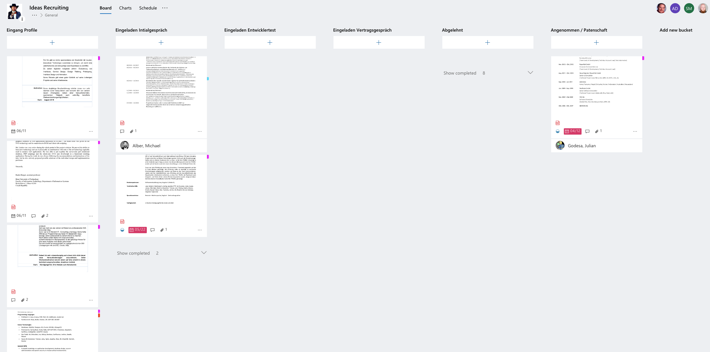

# Recruiting 2.0: Wie wir bei Ideas Engineering rekrutieren

Wir haben keine Team Leads, Abteilungsleiter und nur einen Manager: Unseren [Geschäftsführer](https://www.linkedin.com/in/mialber/). In so einem Unternehmen, das flache Hierarchie und den Geist des Lean Management lebt, kommt dem Recruiting, also der Einstellung von neuen Mitarbeitern, besondere Bedeutung zu. Nur wie macht man das jetzt konkret?

# 

Nicht nur, weil jedes neue Mitglied die Kultur nachhaltig verändern kann, sondern auch, weil wenig Management auch neue Fragen aufwirft. Wer entscheidet über die Einstellung? Wer macht Stellenausschreibungen? Wer redet mit Head Huntern? Was ist mit der Probezeit? Haben wir eine Personalabteilung oder wer kann uns hier helfen? Was ist mit dem Gehalt und wie machen wir das?

Weil das wahnsinnig viele Fragen und noch mehr Antworten sind, besteht dieser Blog-Post auch aus drei Teilen:
* Wie wir bei Ideas Engineering rekrutieren (dieser Post)
* Talk is cheap, show me your code (coming soon, wird dann verlinkt)
* 5 Fehler, die jeder beim Recruiting macht (coming soon, wirdf dann verlinkt)

## Wer macht Recruiting bei Ideas Engineering?

Bei uns ist das Recruiting Team-Sache. Jeder Mitarbeiter bei uns hat als Aufgabe in seinem Job-Profil „Recruiting“ stehen. Und viele andere Dinge, bei uns gibt es 'Das ist nicht meine Aufgabe' nicht. Dabei ist das wie mit dem Wählen gehen: Das ist ein Recht, kein Zwang. Es ist bei uns durch die Geschäftsführung vorgegeben, wie viele offene Stellen wir haben. Wie die zu besetzen sind und was genau die Person können soll, ist dann Sache des Teams, das die offene Stelle hat bzw. das Bedürfnis nach Verstärkung. Die Frage nach der Rolle? Definiert das Team. Wir suchen auch selten "Java Entwickler mit Erfahrung mit Spring", sondern wir leben und arbeiten agil. Agil heißt hier, dass wir z.B. Entwickler suchen. Diese sollten flexbil sein und sich als Problemlöser verstehen. Agile Entwicklung heißt, dass man nicht dafür bezahlt wird Code zu schreiben, sondern Problemlöser zu sein. Ein Spezialist ist vielleicht effektiver, aber bei ständig wechselnden Anforderungen kann (und oft will) er nur Aufgaben aus seinem Gebiet übernehmen. Agiles Arbeiten heißt also mehr in die Breite zu gehen. Ein reiner Java-Entwickler ist bei uns eher schlecht aufgehoben. Jemand, der nur in Ruhe an seinem Rechner arbeiten will, wird bei uns nicht glücklich. Schließlich ist bei uns alles Aufgabe vom Team.

## Der Ablauf

Bewerbungen erfolgen bei uns bidirektional und immer auf Augenhöhe. Es geht nicht nur darum, wer der Beste und Richtige für uns ist - es geht auch darum, ob wir zum Bewerber passen. Die Bewerbung geht in beide Richtungen - auch wir bewerben uns als Firma beim Bewerber.

# 

Jeder Kandidat durchläuft bei uns den folgenden Prozess. Dabei sei gesagt: Wir sind pragmatisch, nicht dogmatisch. In besonderen Fällen kürzen wir den Prozess auch einfach ab, wenn wir uns ganz sicher sind. Auch hängt die genaue Ausgestaltung auch von der gesuchten Rolle ab: Agile Coach, Product Owner oder Business Developer?

Die gesamte Kommunikation und Planung erfolgt über den Microsoft Office Planer und Teams als Chat Tool. Dort werden die Profile eingestellt und wir sorgen damit dafür, dass nichts herunter fällt. Alles bekommt einen Zeitstempel und wir wissen genau, warum wir wen eingeladen haben und was jeder denkt.

* In einigen Fällen (z.B. bei Empfehlungen) gibt es ein **inoffizielles Kennenlernen** und Vorstellung der Firma, bevor sich der Kandidat entscheidet sich offiziell bei uns zu bewerben
* **Eingang der Bewerbung**, der Kandidat wird auf unserem Kanban-Board erfasst 
    * Beurteilung der offiziellen Bewerbung (durch alle Interessierten) und Diskussion des Profiles
    * Wenn der Bewerber aus formalen Kriterien rausfällt (z.B. wenn er Ruby-Programmierer ist oder kein Deutsch spricht) wird ihm abgesagt. Gibt es generell Zweifel an dem Bewerber kommt es ggf. zu einem 30min 
    * Bewerbungen/Profile enthalten bei uns keine Gehaltswünsche, - diese werden vorher geschwärzt und sind nur dem Management bekannt
* **Kennenlerngespräch** (1h, Mit 2 bis maximal 3 Kollegen)
     * Das Gespräch hat als Ziel, dass der Bewerber uns als Firma kennenlernt, unsere Arbeit und versteht, wie und woran wir arbeiten
* **Fachlicher Test** mit anschließendem Teamfit
    * Bei einem Agile Coach oder Product Owner ist dies eine andere Aufgabe, z.B. die Moderation einer Retro oder Durchführung eines Groomings
    * Ziel ist dabei eher das Gespräch hinterher
* Teamfit nach dem Test (gemeinsames Mittagessen, Kaffee, Pizza in der Lounge)
* **Formelles Gespräch** mit einer Führungskraft und einem Kollegen aus der HR-Abteilung
    * Hier geht es vor allem um Vertragskonditionen
    * Natürlich hat die Geschäftsführung immer ein Veto-Recht
    * Erst hier, wenn beide Seite sich einig sind, dass man zusammenarbeiten will, wird über das Gehalt gesprochen. Dazu aber mehr im dritten Teil dieser Serie.

## Wo kommen die Bewerber her?

Der Großteil unserer Kandidaten kommt über Empfehlungen. Leute, die wir kennen oder treffen. Der Rest kommt über Head Hunter. Diese werden von uns gebrieft und bekommen unsere Stellenausschreibungen. Meistens fühlt sich einer dafür besonders verantwortlich, im Laufe der Zeit haben aber viele von uns bereits die Koordination der Head Hunter übernommen. Besonders Leute, die generell dazu neigen tolle Führungsfähigkeiten zu zeigen, engagieren sich hier oft besonders.

Unsere Ausschreibungen machen wir selbst: Die meisten Personaler haben davon sowieso keine Ahnung. Wir [suchen](https://career.axelspringer.com/job/software-engineer-aus-leidenschaft-berlin/) dabei ganz verschiedene [Profile](https://career.axelspringer.com/job/product-owner-m-w-d-berlin/) und sind gerne etwas [kreativ](https://career.axelspringer.com/job/backend-artist-mit-frontend-foo-some-ops-skills-baffos-berlin-2/).

## Das Kennenlerngespräch

Das Gespräch dauert eine Stunde und wird von zwei komplementären Persönlichkeiten von uns durchgeführt. Im Normalfall holen wir den Bewerber immer am Hauptempfang (dem Haupteingang vom Hochhaus) ab, führen ihn kurz durch die Passage und erzählen ihm von Axel Springer als Konzern, dass wir eine digitale Firma sind, die 70% von Umsatz und Gewinn mit reinem Digitalgeschäft macht. Wir stellen Ideas Engineering als eine von 180 Töchtern (Business Units) von AS vor.

 Eine Führung für den Bewerber durch die Räumlichkeiten gibt es vor oder nach dem Gespräch, dabei erklären wir dem Bewerber extrem viel. Wie und woran wir arbeiten. Wie es bei uns abläuft. Wer wir sind.

## Be the judge!
Die Beurteilung eines Bewerbers erfolgt grob nach vier Kriterien.

* Qualifikation
* Kulturfit
* Analytische Fähigkeiten
* Denken in Innovationen

### Qualifikation
Hier geht es um das fachliche Wissen des Bewerbers. Wir suchen generell Leute, die sich als Problemlöser des Kunden verstehen. Keinen Java-Entwickler, der nur Java und nur mit Spring arbeitet. Sondern allgemein Software Entwickler (im Gegensatz zum einfachen Programmierer). Generell wird hier im das Bild des T-Shaped Professionals als Vergleich herangezogen: Was ist das Plus von dem Bewerber, was bringt er sonst noch mit? Das kann sehr unterschiedlich ausfallen – bei manchen ist es zusätzlich Linux und Ops , bei anderen Frontend. Vielleicht ist sind es aber auch ausgeprägte Softskills, die das Profil des Bewerbers zum T machen.
 
Ein kleine Zusammenfassung: Fachliches Know-How, aber wir suchen immer Bewerber, die breit aufgestellt sind und ein gewisses Plus an Fähigkeiten mitbringen.

### Kulturfit
Das setzt natürlich voraus, dass man sich innerhalb der Firma einig ist, was die gelebte Kultur ist. Bei uns ist die der hohe Grad an Selbstständigkeit und eine stark persönliches Ausleben der Rolle. Auch hier helfen die richtige Fragen im Kennenlerngespräch, wie sich der Bewerber in bestimmten Situationen verhalten könnte oder er z.B. “Was sind drei Dinge, die für dich ein No-Go bei deinem neuen Arbeitgeber sind?" Was explizit nicht gemeint ist, ist das Lieblingsbier oder ob der Bewerber Videospiele mag. Auch nicht, dass wir kostenlose Mate und Bier haben. Wichtig bleibt, dass man nicht seinen Doppelgänger anheuert, nicht nur den gleichen Typ von Mensch und nicht immer nur Leute mit denen jeder klar kommt. Auch wichtig: Kann man sich vorstellen, dass der Bewerber das Team besser macht? Würde er sich auch selbst am Recruiting bei uns beteiligen?

Um es zusammenzufassen: Es geht um die Einstellung zum agilen Arbeiten, flachen Hierarchien und einem hohen Grad an Selbstständigkeit.

###  Analytische Fähigkeiten
Heute wird es als moderner Mitarbeiter immer wichtiger auch die Geschäftsprozesse zu verstehen. Wie gut versteht der Bewerber eigentlich technische Konzepte und kann er das große ganze fassen? Beim crossfunktionalen Arbeiten ist dies besonders wichtig – man ist nicht mehr auf seiner fachlichen Insel gefangen, sondern soll gemeinsam als Team arbeiten. Dazu muss auch verstanden werden, warum man etwas macht und wie alles ineinander greift.

Kurz und knapp: Der Bewerber sollte eine gute Auffassungsgabe haben und Zusammenhänge einfach verstehen können.

### Denken in Innovationen
Etwas schwerer zu erklären – hier geht es um den kleinen Intrapreneur im Bewerber. Dazu zählt, dass ein Entwickler auch über den Tellerrand blickt und wie ein Unternehmer denkt. Ein Verständnis der Wirtschaftlichkeit gehört heute dazu. Bei AS Ideas ist generell gefragt, dass man sich stark selbst einbringt und Themen treibt. Im selten Fall sind Entwickler bei uns einfach nur Programmierer, sondern wir definieren die Rolle sehr breit.

Nochmal kurz und knapp: Bei uns braucht man viel eigenen Antrieb und muss kreativ sein und Ideen einbringen.

## Next step: Die fachliche Eignung

Weiter im zweiten Teil über die fachliche Eignung.

##### P.S.:
 Es gibt sicherlich offene Fragen und einige Dinge sind kontrovers, zum Beispiel: Wieso keine Ruby-Entwickler? Dafür muss man meinen Humor kennen. Warum braucht man bei uns Deutschkenntnisse? Dafür muss man unsere Aufgaben und Projekte kennen.

