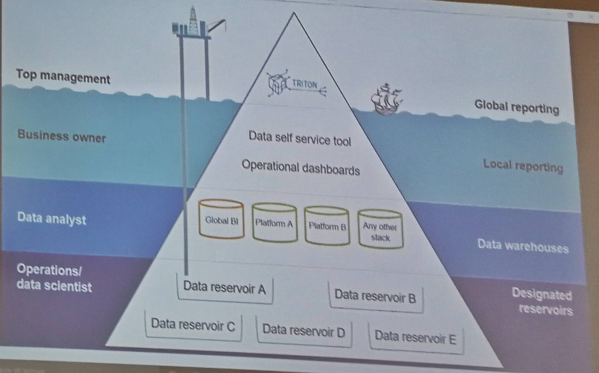

# 
# Axel Springer AWS Cloud Summit

All developers fear one thing: A sales session instead of something useful. I have seen it in the past - a workshop with a vendor masked as technically and for developers. Which in the end was nothing but a sales pitch. You can image what I thought when Axel Springer planned an internal AWS Summit mainly organised by non-techies and directly from AWS. But in the the end we had a good run with our first internal AWS Summit. 

TL;DR: We got 6 talks, 2 were good, 2 were ok and 2 were not so good. Learning: Never let anybody with “Account Manager” in their job title give any talk on any event. And check your crowd - with most people beeing in engineering and already using AWS the talks should be more technical and go more into details.

For everybody not familiar with [AWS Summits](https://aws.amazon.com/de/summits/): It's actually a global series of free events organized by AWS themself. It's about connecting, collaborating, and learning about AWS. These events normally are huge, impressive, with great speakers and great coffee. These normal AWS Summits span in technical depth from introduction to advanced. They are great, you not only get to learn many things, but you also get to network. You can talk to AWS architects about your use cases, meet with vendors or see which certifications can help you.

At Axel Springer we use mostly AWS, but other cloud platforms as well. And we are also not one company, but a family of business units. And each unit, or brand, is independent. We all use AWS, but we don't share our knowledge enough. An internal AWS Summit is a great way for us not only to learn and talk with AWS architects directly, but also to share our own knowledge. And we have some special needs, which often are not addressed enough at the normal summits, like video transcoding and text processing with ML. So we got our own summit, especially with topics for the media industry!

Overall our first summit was a "little bit" better than mediocre, like mentioned above. We had two great talks, two more or less good talks and two not so good talks. The talks were quite different in their target audience. Only one showed code, most talks were introduction talks, one was even a (really bad) sales pitch for AWS enterprise support. The audience consisted mainly of developers and engineering managers.

## Talk 1: Data Lakes on AWS
The first talk was from Tufan, a Senior Cloud Architect from AWS. It was actually an overview and intro talk with what is possible and which tools exist on AWS. It gave insights into what Big Data is and where it came from. What is Big Data all about, the history, which technologies have been used, why do we even need data? The next part was about how AWS enables you to work with your data. Which services exist, how do they interoperate. The three conclusions are:
* Separate data from compute
* You need a single source of truth
* Use the right tool for the job

## Talk 2:  The Voice of a Customer
The second talk was from an Information Systems Architect, also from AWS, named Hector. His main customer is a company called OLX, the biggest tech company you never heard of. It was actually way better then the first one, as it told a story. It starts with the OLX Group and what they do and how they worked with their data in the past. What data did they need, how did they work? What dashboards did they have? He showed the whole story and what AWS services they used and what additional tools they had. In the end he even showed in all details the costs: What was used (from AWS) in which dimension and what it did cost. A hint: It was a bargain. The story told came to three conclusions:
 * Different people, different needs (from CEO to Ops): There are different needs for different persons.
 * "We provide more data, just because we have it": All dashboards have to many data on it, it should be nearly empty, with no trash.
 * ~“Everything" is over-rated, nobody needs everything.

# 

## Talk 3: Artificial intelligence in broadcast - how to improve content with meta data through image and text recognition
This was the only talk not from an AWS employee. Yannick (from [Logic](http://www.logicmedia.de/)) gave us insights how their video processing pipelines work, what they do with ML/AI and how they integrated everything with various AWS services. Logic is a tech company from a small village next to Darmstadt, they have 22 employees, 5 people are in the cloud team and they focus on cloud based broadcast. And they had many problems in the past, here are three real quotes from customers he gave us:
* "It was quicker for us to shoot the video again than try to find it in the archive"
* "I don’t even know what I have in my archive"
* "I wish I could earn more from my videos"

He talked a lot about why and how AI can help. And with what and why they expierenced such bad results, like for instance speech to text for live transcription. He gave great insights in what they tried and what works.

## Talk 4: Cost optimisation with AWS enterprise support
This was a substitute talk, from Jacek, a Technical Account Manager from AWS. Actually our colleagues from ONET planned to give a talk focusing on their  migration to the AWS Cloud and how they prepared. But they could not make it 😞 

What did we get instead? A sales pitch. Something meant for "managers". About cost optimisation. And about how much enterprise support will help you. The talk was also like super bad.

# 

## Talk 5: Amazon Elasticsearch Service
This was actually not a bad talk - if you know nothing about Elasticsearch but that is used in the ELK stack. The talk was split into two parts, the first was from Bob (AWS Business Development Manager) and the second from Kevin (AWS Senior Specialist Solutions Architect).

They first asked who used Elasticsearch (like 90% of the crowd) and who uses it for fulltext search (like 30% of the crowd). I think they didn't expect that. What can you take from this talk? That, you need to check your crowd.

The second part was more technical. It is hard to manually manage large Elasticsearch clusters and AWS can help you a lot. Elasticsearch on AWS is fully managed and some services like CloudWatch can push logs directly to Elasticsearch.

# 

## Talk 6: Amazon Neptune: Amazon’s new managed GraphDB service – Building Applications on Highly Connected Data
In my opinion the winner of the day. It not only explained the difference between graph databases and other databases, but also the use cases. And then he went into full beast mode: We saw code, he explained the two different options to query Neptune. Our freelance expert in graph databases asked some questions and then we went full graph deep dive. Such a great talk!

Here you can see our super excited developers who work with AWS Neptune on their current project:
# 

## What's next

We definitely will have another internal AWS Summit in 2019. It was a good start, but far from perfect. Next time we will have more internal talks and the talks from AWS will have more advanced topics. Even with breakfast and lunch the networking was not good enough - I think we will also improve on that part with some new ideas.
