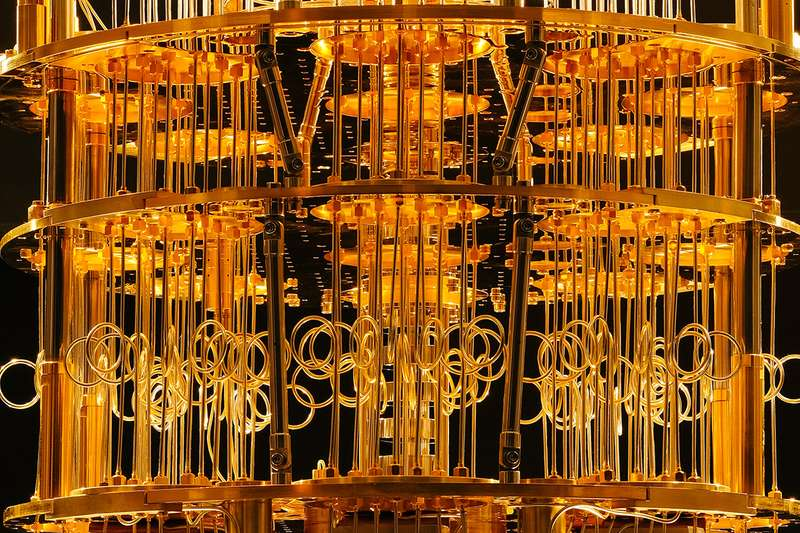
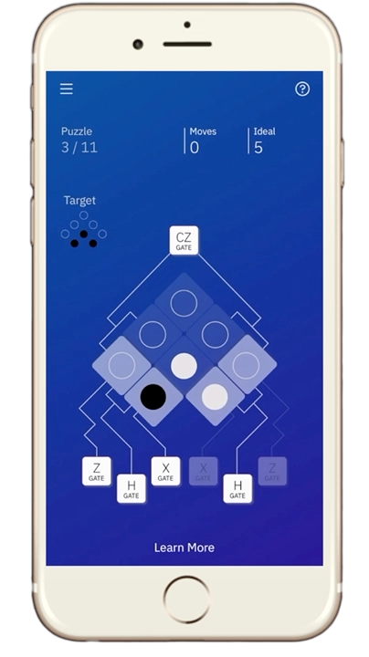
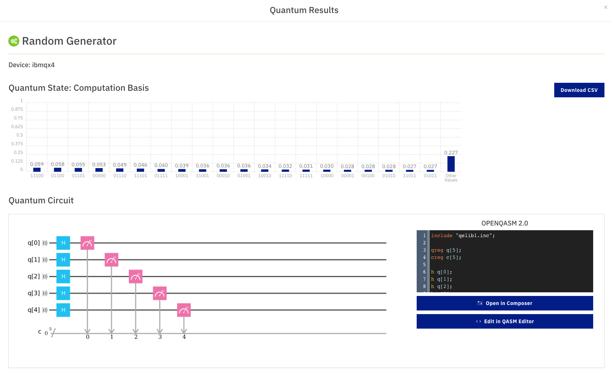

# Quanten Computer

Im Mai 2016 veröffentlicht IBM den ersten, als Cloud Service öffentlich zugänglichen 5 Qubit Quantencomputer. Die Hoffnungen in die Technologie sind imens. Mit ihrer Hilfe möchten die Wissenschaftler Probleme lösen, die mit klassischen Computern nicht bzw. nicht in brauchbarer Zeit zu lösen wären. Doch wo steht die Technologie, was kann man mit dem Quantencomputer heute schon anstellen und wie programmiert man eigentlich Software dafür? 

Diesen Fragen möchten wir nachgehen!

# 

## Quantencomputer heute

IBM baut echte, physische Quantencomputer. Es gibt sie schon mit 5, 16 und 20 Qubits und einen Prototypen mit 50. Qubits sind Quanten Bits. Das ist beeindruckend! Doch für eine sinnvolle Anwendung oder gar die Quantum Supremacy (der Quantencompter übertrifft den klassischen) braucht es mehr. Wieviele Qubits weiß man nicht so recht. Vielleicht [100](https://thenextweb.com/artificial-intelligence/2018/02/06/heres-why-100-qubit-quantum-computers-could-change-everything/), [4000](https://security.stackexchange.com/questions/87345/how-many-qubits-are-needed-to-factor-2048-bit-rsa-keys-on-a-quantum-computer) oder [1 Million](TODO!) Ein weiterer limitierender Faktor ist, das Qubits nur [einige ms stabil](TODO) sind. Dann werden sie chaotisch. Diese Zeit wird TODO genannt. Offen ist auch, ob [Moore's Law](https://de.wikipedia.org/wiki/Mooresches_Gesetz) auch bei Quantencomputern gilt. Danach verdoppelt sich die Leistung integrierter Schaltkreise alle 12-24 Monate. Die aktuelle Entwicklung bei IBM ist jedenfalls schneller! Auch sind noch nicht alle Operatoren, sogenannte Gates, auf der heutigen Hardware verfügbar, die in der Theorie offenbar als grundlegend gelten, wie das [CZ-Gate](TODO)

Woher kommt also das Vertrauen in die Technologie, was rechtfertigt die Hoffnungen? Quantencomputer verarbeiten Qubits parallel. Und mit jedem weiteren Qubit [verdoppelt](TODO) sich potentiell die Leisung. Und jüngst hat ein Forscherteam um IBM, das MIT und von der Universität München den [mathmatischen Beweis erbracht](TODO), das es Anwendungsgebiete gibt, in denen Quantencomputer den klassischen inherent überlegen sind. Demnach bleibt die Tiefe, also die Anzahl benötigter Operationen, bei [Shor's Algorithmus](TODO) zur Primfaktorzerlegung konstant,unabhängig vom Input, während sie bei klassischen Computern exponentiell mit der Größe der Ausgangszahl ansteigt! Quantencomputer bedrohen die heutige Verschlüsselung von IT-Systemen, deren Sicherheit auf großen, heute nicht zerlegbaren Primzahlen basiert.

## Die Basics lernen

Bevor wir eine Ausflug in die Grundlagen der Quantencomputer machen, sei gesagt, das man sie vielleicht am besten spielerisch erlernt. Zusammen mit dem Quanten Blogger [Dr. James Wootton](TODO) hat IBM ein Spiel für Mobilgeräte entwickelt: [Hallo Quantum](http://helloquantum.mybluemix.net/). Das Spiel zeigt anhand einer Visualisierung eines 2 Qubit Quantencomputers, wie sich Qubits verhalten, mit einer kleinen Auswahl an Gates (Operatoren) manipuliert werden und wie man sich den Zustand des Systems vorstellen kann. Wer noch ein bischen mehr wissen möchte, sollte sich auch noch den [Entwicklungsprototpyen](https://www.pythonanywhere.com/gists/a5d885816f7dc042a78df11ce6cf9652/main.py/ipython3/) anschauen, in dem einige Ideen umgesetzt wurden, die für das Spiel letztlich verworfen wurden. Dieser ist bei [PythonAnywhere](https://www.pythonanywhere.com/gists/a5d885816f7dc042a78df11ce6cf9652/main.py/ipython3/) online verfügbar.

# 

## Die Grundlagen

Im Folgenden möchten wir unseren persönlichen Eindruck in die Welt des Quantenrechnens schildern, ohne Anspruch auf völlige Richtigkeit und korrekte Notation :) Ein Qubit hat einen zweidimensionalen Zustand bzw. entspricht einem Vektor mit zwei Werten. Die Werte können jeweils 0, 1 oder beides sein. Letzteres wird Superposition genannt. Ein Qubit wird stets mit den Werten 0 im ersten Teil und der Superposition im zweiten Teil initialisiert. Eine Messung gibt den ersten Teil des Qubits zurück. Wird eine Superposition gemessen, entscheidet sich das Qubit zufällig für den Wert 0 oder 1. Mit sogenannten Gates werden die Zustände eines Qubits manipuliert. Einfache Gates flippen einen Wert des Qubits von 0 auf 1 oder umgekehrt. Random bleibt random. Das H-Gate vertauscht die beiden Werte eines Qubits. So lässt sich dann auch die Superposition eines Qubits messen, indem zuerst das H-Gate angewendet wird. Interessant für Anwendungen sind vor allem Gates, die auf mehreren Qubits arbeiten. Die Qubits spannen eine n-dimensionale Matrix auf mit (4 hoch n) - 1 Korrelationen. n ist die Anzah der Qubits. Die Korrelationen stellen den Zustand des Quantensystems dar. Mit jedem weiteren Qubit vervierfacht sich also die Anzahl der Korrelationen, und damit vermutlich auch die Leistung des Quantenrechners. Jede Korrelation beschreibt das Verhältnis zweier Qubits zueinander. Im Fall einer Superposition können zwei Qubits bei gleichzeitger Messung je nach Zustand der Korrelation beide denselben Wert zurückgeben oder den genau entgegengesetzten. Sind die Quanten nicht verschränkt, geben sie unabhängige Zufallszahlen wider.

Daraus entfaltet sie auf für uns wundersame Weise die Magie des Quantenrechners...

## Quantenprogrammierung

Derzeit erinnert ein Quantenprogramm stark an Assemblercode. Es wird ein Quantenregister initialisiert, auf dem die Qubits mittels der Gates manipuliert werden. Dafür gibt es von IBM die Notation QASM. Alternativ lässt sich das auch schön graphisch in der Web Oberfläche, dem Composer, darstellen. Hier können Programme per drag & drop erstellt werden. QASM und Composer code ist kompatibel und lässt sich in einander überführen. Dazu gibt es das Python Framework [Qiskit](TODO). Damit lassen sich die Programme in Pyhton schreiben. Der Quanten Code ist im Grunde derselbe, allerdings lässt es sich so in ein klassisches Python Programm einbinden. Dazu gehören dann beispielsweise Auswahl des Quantenrechners oder Simulators, legen des Jobs auf die Queue, User Input und User Output. Die meisten Beispielprogramme werden als Pyhton [Jupyter Notebook]() abgelegt.

## Quanten Random Number Generator

# 

Im Screenshot zu sehen ist unser Beispielprogramm im IBM Composer. Es erzeugt eine 5-Bit Zufallszahl, also zwischen 0 und 31. Es sei erwähnt, das es sich hier (vermutlich) um eine echte Zufallszahl handelt. Klassische Computer sind nur in der Lage Pseudozufallszahlen zu generieren. Das Progamm initialisiert 5 Qubits und vertauscht jeweils ihre zwei Werte mittels das H-Gates, so dass bei den folgenden Messungen jeweils eine Superposition gemessen wird, die das Qubit zwingt zufällig den Zustand 0 oder 1 einzunehmen. So entsteht die 5-Bit Zufallszahl. Das Programm wird dann mehrfach ausgeführt, in dem Beispiel 1000x. Diese Wiederholungen nennt man Shots. Über die Erhöhung der Shots konvergieren zufällige Ergebnisse in ihre mathematischen Wahrscheinlichkeiten.

## Fazit

Noch steckt die Technologie in den Kinderschuhen. Die Theorie ist komplex, das Engineering der Hardware ausgesprochen aufwändig, die Programmierung kompliziert und die Leisung beschränkt. Und doch sind die bisher erreichten Ergebnisse beeindruckend, stärken das Vertrauen und beleben die Vision. IBM setzt auf eine lebendige Community mit freiem Zugang zu einfachen Quantenrechnern. Und auch der Internetriese Google ist eingestiegen und kündigt einen [72 Qubit Quantenrechner](https://www.technologyreview.com/s/610274/google-thinks-its-close-to-quantum-supremacy-heres-what-that-really-means/) an. Die Frage, ob es Quantenrechner geben wird, scheint überholt, sondern lediglich wann. Sicher aber ist nichts. Wir werden es mit Spannung verfolgen!