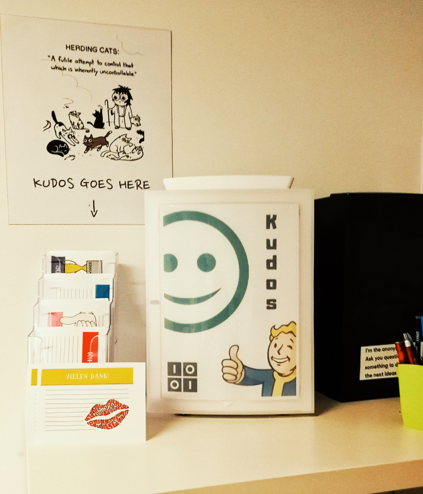
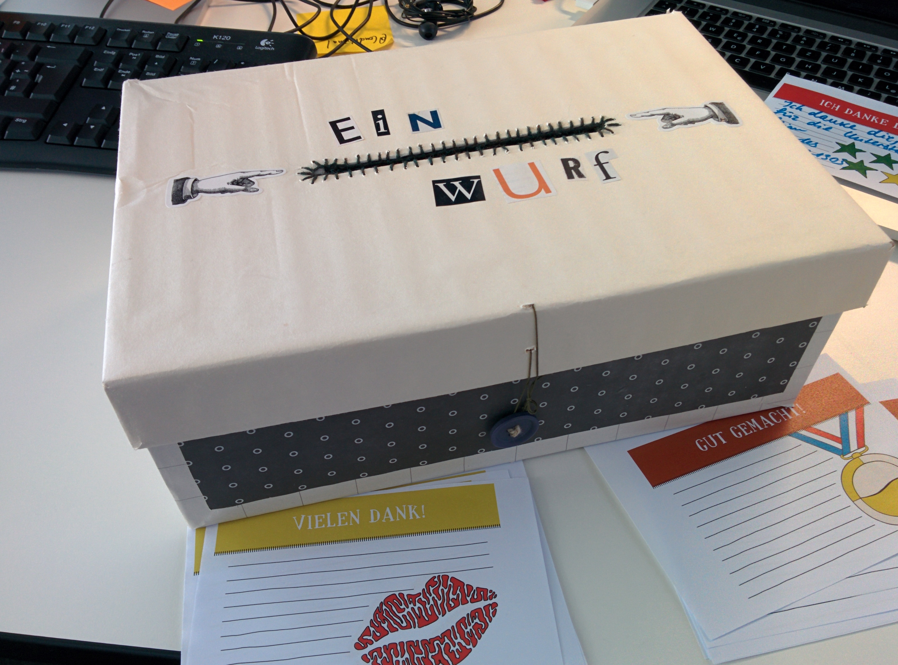
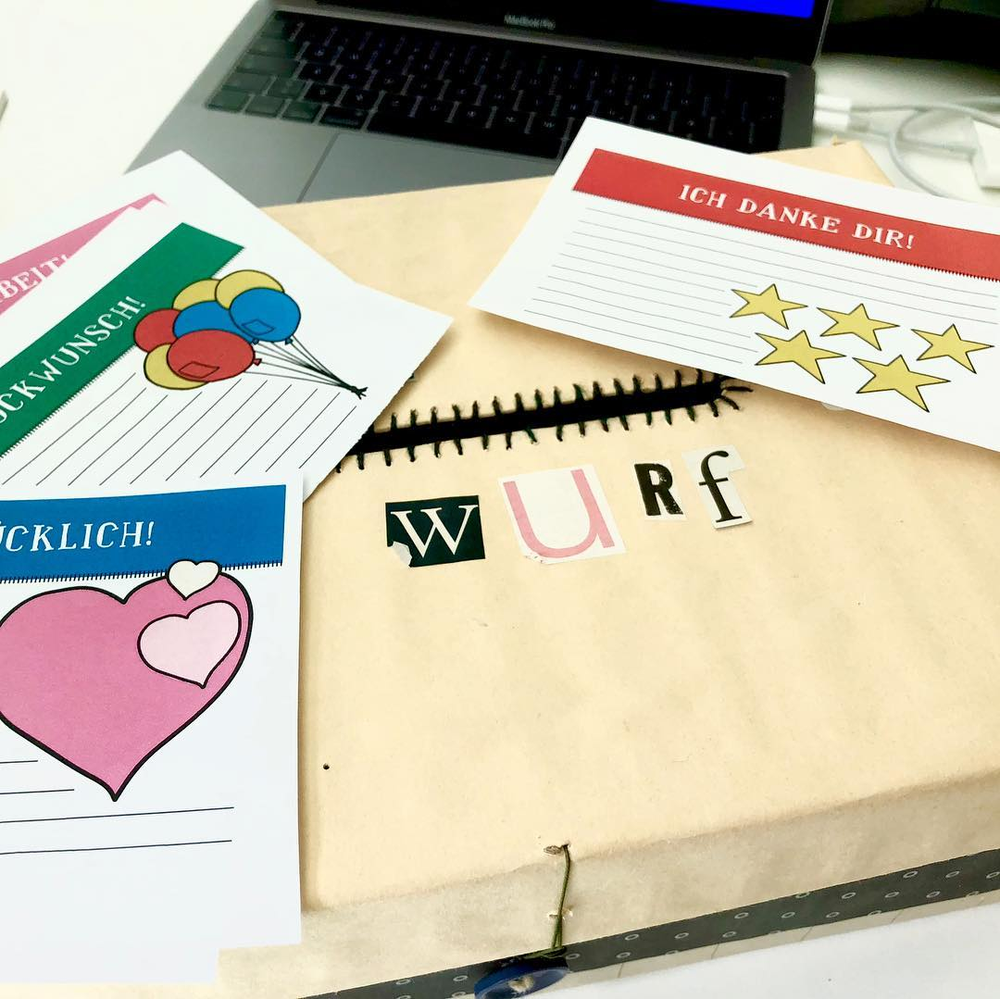
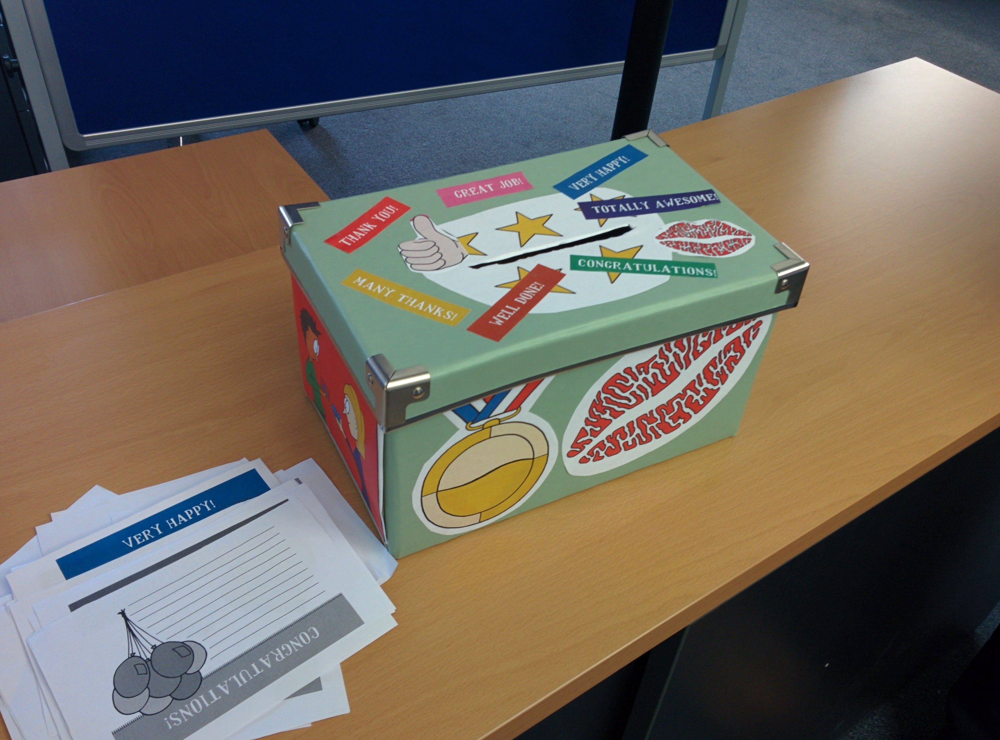

# 

Positives Feedback ist um ein vielfaches effektiver als Kritik, selbst bei sehr konstruktiver Kritik. Trotzdem tun wir uns nicht nur mit dem Geben von Feedback schwer, sondern insbesondere mit Lob. Einfach mal Danke sagen und Anerkenung ausdrücken. Noch schwerer wird es bei der Selbstorganisation: Wer ist eigentlich für Feedback zuständig? Sicherlich nicht mehr der Chef.

Deswegen kommt hier unser Cultural Hack #1! [Da man Kultur nicht managen kann](https://axelspringerideas.de/blog/2018/11/cultural-hacking-101/), braucht man manchmal ein paar Hacks, um an der eigenen Kultur zu arbeiten. Deswegen diese Serie - im [ersten Post](https://axelspringerideas.de/blog/2018/11/cultural-hacking-101/) erfahrt ihr nicht nur, was Kultur ist, sondern auch wie man sie beeinflußen kann. Und in diesem Post geht es dann ganz konkret um den ersten Hack.

# Kudos aus dem Schuhkarton

Wir hatten inzwischen bereits drei verschiedene Kudos Boxen. Im Lauf der Zeit haben wir einfach schon zwei Stück verschlissen! Von der "mittleren" Box habe ich gar kein Foto mehr, aber hier sehr ihr unsere erste Box, die wir aus einem Schuhkarton liebevoll gebastelt haben:

# 

[Die Idee selbst stammt aus der Management 3.0 Bewegung](https://management30.com/practice/kudo-box/), die ich nur jedem empfehlen kann. Wir haben die entsprechenden Vorlagen der Kudos-Karten im Copy-Shop drucken lassen und haben diese an verschiedenen Orten mit Stiften ausgelegt. Alle zwei Wochen haben wir ein "All-Hands"/"Townhall-Meeting" und am Anfang lesen wir immer die Kudos Karten vor. Natürlich wird bei jeder Karte geklatscht!

# 

# Warum soll ich jetzt diese "Postkarten" schreiben?

[Kudos](https://www.urbandictionary.com/define.php?term=kudos) ist eine Bekundung von Respekt und Dank. Viel zu selten feiert man die positiven Dinge, viel zu oft konzentriert man sich auf Probleme. Wertschätzung untereinander ist enorm wichtig. Ich war selbst überrascht, wie regelmäßig und wie viele Karten immer geschrieben werden. Inzwischen ist die Kultur der Wertschätzung bei uns tief verankert.

> If you want to be okay, write your Kudos every day!

Und das ist auch das Ziel dieses Hack: Eine positive Grundstimmung setzen und Feedback geben üben. Am Anfang gab es auch Phasen, wo sehr wenige Kudos geschrieben worden. Dann waren nach zwei Wochen auch nur zwei Zettel in der Box. Und wenn ein paar Kudos vorhanden waren, dann waren es oft für und von den gleichen Leute bzw. den gleichen Teams. Jetzt, nach ein paar Jahren, sind die Kudos bei uns gleichmäßig von Allen und an Alle. 

# Also, wie geht das jetzt?

* Vorgedruckte Kudos-Karten liegen überall im Büro aus (Vorlagen gibt’s im [Internet](https://management30.com/wp-content/uploads/2015/02/kudo-cards-german-self-A4.pdf))
* Eine Kudos-Karte richtet sich an eine konkrete Person und benennt einen Aspekt, über den man sich gefreut hat. Auch ganz alltägliche Dinge.
* Der Absender bleibt anonym. Die Karte kommt in die Kudos-Box
* Bei Team-Meetings wird die Box geleert und alle Karten werden vorgelesen. Applaus bitte!
* Wer Anerkennung bekommt, ist sehr motiviert, das gezeigte Verhalten zu wiederholen

# Butte bei die Fische: Das Rating

Insgesamt sind die Kudos einer meiner Lieblings-Hacks. Als wir damit vor 4 Jahren angefangen haben, hätte ich nicht an diesen nachhaltigen Erfolg und tollen Effekt geglaubt. Ja, es war nicht immer einfach, die Kudos am Leben zu halten, aber irgendwann ist es zu einem Selbstläufer geworden.

Wie einfach ist das Durchführbar? Tatsächlich ziemlich einfach: Ihr baut eine Box, druckt die Karten und fangt einfach an. Trotzdem muss man sagen, dass man hier auf Widerstände treffen wird: Einige wollen wahrscheinlich am Anfang nicht mitmachen.

Die Wirkung auf die Kultur darf man nicht unterschätzen: Es sind nicht einfach nur Karten mit Dankbarkeit. Es ist der Weg dazu, sich gegenseitig mehr Feedback zu geben. Und sich auf die positiven Dinge zu konzentrieren. Bei uns waren die Kudos-Karten ein wichtiger Teil unseres Weges, dass wir das Geben von Feedback als Aufgabe von Allen begreifen. 

Abzüge bei der Begeisterungsfähigkeit / Awesomness: Es wird viele geben, die das Schreiben von Kudos am Anfang affig finde. Auch sich selbst zu feiern und zu klatschen, wird einigen am Anfang schwer fallen. Bei uns gab es auch ein paar Startschwierigkeiten: Einige wollten einfach nicht mit machen.

Und zu Abschluß noch das Bild einer Box von [Immowelt](https://www.immowelt.de/) aus Hamburg! Denn immo erst zu immowelt ;)

# 

# Cultural Hacking

Dieser Hack ist Teil einer kleinen Serie, in der ich über unsere Cultural Hacks schreibe. Diese haben sich im Laufe der Zeit bei uns angesammelt! Im ersten Post "Kultur kann man nicht managen" bekommt ihr eine Übersicht, was Kultur bedeutet und wie man sie beeinflußen kann.

* [Kultur kann man nicht managen: Cultural Hacks zum selber Ausprobieren](https://axelspringerideas.de/blog/2018/11/cultural-hacking-101/)
* [Cultural Hack #1: Die Kudos-Box aus dem Schuhkarton](https://axelspringerideas.de/blog/2018/11/cultural-hack-no-1-kudos/)
* Cultural Hack #2: Und wie geht's uns denn heute? Nico-Nico Kalender mit TeamMood.com
* Cultural Hack #3: We are Legion: Anonyme Suggestion-Box
* Cultural Hack #4: Zeitmessung mit Lego: Was haben wir eigentlich die ganze Zeit gemacht?
* Cultural Hack #5: Team Budgets aka "Wir wollen einen Billiard-Tisch"
* Cultural Hack #6: Urlaubsplanung mal anders
* Cultural Hack #7: Lebenslanges Lernen? Dann aber bitte mit Bücherbudgets!
* Cultural Hack #8: Und was ist wenn er uns dann verlässt? Weiterbildungen für alle.
* Cultural Hack #9: No Coffee? No Worky! Belohnungen für Teams, nicht für Einzelne
* Cultural Hack #10: Tod den Meetingräume
* Cultural Hack #11: Ein bisschen Huddle - Inverses Reporting
* [Cultural Hack #12: Hacksite - Klassenfahrt mit Arbeitsbezug](https://axelspringerideas.de/blog/2018/11/hacksite/) von [(Macro Böttcher)](https://www.linkedin.com/in/marco-b%C3%B6ttcher-55a74324/)
* Cultural Hack #13: Anti-Hacks: Vom Shit-O-Meter bis Fuck Up Wand
