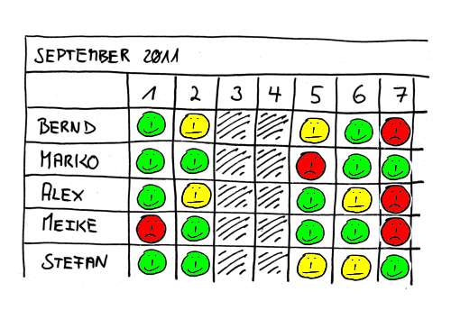
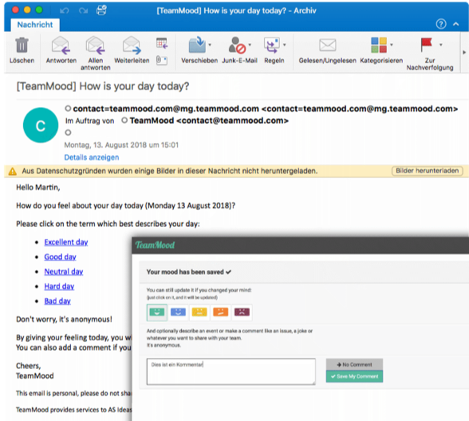
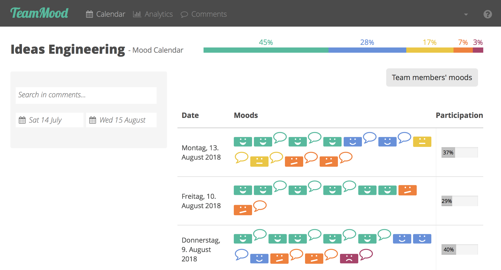
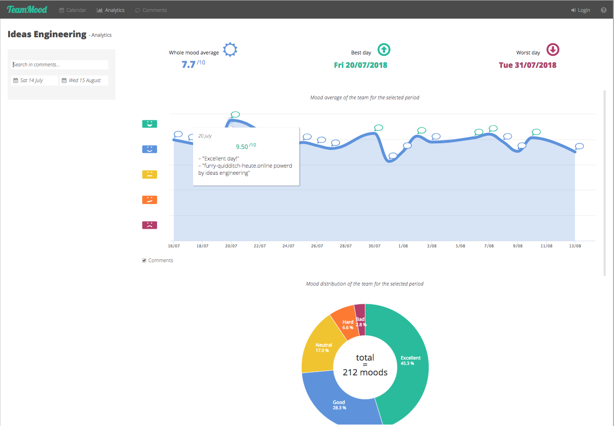
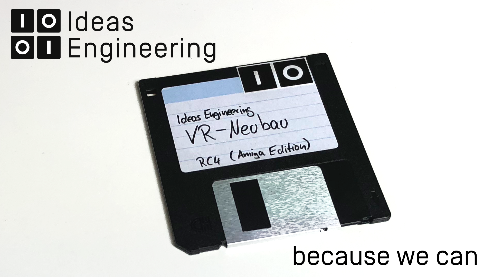

# 

Zufriedene Mitarbeiter sind eine der Säulen von selbstorganisiertem Arbeiten. Und die Stimmung und Probleme der Mitarbeiter muss man daher sichtbar machen. Sichtbarkeit ist enorm wichtig, gerade bei flachen Hierarchien. Nicht nur um rechtzeitig zu reagieren, sondern um eine Kultur von Offenheit und Vertrauen zu schaffen. Aber wie mache ich die Stimmung sichtbar? 

Deswegen kommt hier unser Cultural Hack #2! [Da man Kultur nicht managen kann](https://axelspringerideas.de/blog/2018/11/cultural-hacking-101/), braucht man manchmal ein paar Hacks, um an der eigenen Kultur zu arbeiten. Deswegen diese Serie - im [ersten Post](https://axelspringerideas.de/blog/2018/11/cultural-hacking-101/) erfahrt ihr nicht nur, was Kultur ist, sondern auch wie man sie beeinflußen kann. Der Rest sind unsere Erfahrungen der letzten Jahre, was wir ausprobiert haben und was bei uns funktioniert hat. Und in diesem Post geht es ganz konkret um den zweiten Hack.

# Und wie geht's uns denn heute? Digitaler Niko-niko Kalender

Abhilfe schafft ein Niko-Niko Kalender. Und wo kommt's her? Natürlich aus Japan, dem Land des Toyota Production Systems. Das japanische Wort "niko" meint etwa "lächeln". Wenn man dem typischen wiederholen von Wörtern in der japanischen Sprache folgt, so bedeutet "niko-niko" grob "smiley" (also ein Symbol eines lächelnden Gesichtes). Oft wird es auch einfach als "Stimmungsboard" bzw. "mood board" bezeichnet. [Akinori Sakatahat hat 2006 in diesem Artikel]( http://www.geocities.jp/nikonikocalendar/index_en.html) zum ersten Mal über diese Kalender geschrieben, aber noch in der analogen Form.

Kurz und knapp: Es ist eine tägliche Mitarbeiter-Umfrage. Dazu eine wöchentliche Zusammenfassung. Das verhindert effektiv, dass die Stimmung am Tiefpunkt ist, bevor jemand reagiert. Und es schafft eine Kultur von Offenheit und Vertrauen: Es wird oft genug negative Kommentare geben, mit denen ich nicht einverstanden bin. Oder bei denen ich mich angesprochen fühle. Und das ist auch gut so: Denn nur was offen für alle ist, kann auch angegangen werden!

# 

# Not invented here syndrom: TeamMood.com

Unsere erste Idee: Wir bauen das selbst. Und genau das haben wir getan. Wir haben eine Web-App entwickelt und wollten diese auf iPads an den Eingängen laufen lassen. Eigentlich ganz cool, aber auch ziemlich aufwendig. Und fehleranfällig! Da kann ja jeder an einem miesen Tag ständig auf den "Sad"-Smiley drücken, so oft er will. Und Kommentare wird ja wohl auch keiner hinterlassen?!

Aber da haben wir etwas tolles herausgefunden: Andere Leute hatten solche Ideen schon vor uns! Ursprünglich haben wir deswegen vor einigen Jahren mit [moraleapp.com](http://moraleapp.com/) angefangen. Als dann Ende 2016 moraleapp.com seinen Dienst einstellte, sind wir auf [TeamMood](https://www.teammood.com/) gewechselt.

# 

Was macht TeamMood jetzt für uns? Es schickt einfach jedem Mitarbeiter, den der Administrator einträgt, eine tägliche E-Mail! Dazu gibt es noch die Möglichkeit Kommentare abzugeben und ordentlich viele Statistiken. 

Also: Jeder Mitarbeiter hat genau eine tägliche Stimme, um seine Stimmung und einen optionalen Kommentar abzugeben.  

# 

# Also, wie geht das jetzt?

Auch ohne TeamMood.com gibt es genung Anbieter am Markt, die das anbieten. Der Ablauf ist immer der gleiche:

* Jeder Mitarbeiter kriegt täglich eine Mail mit 3 Links 
   * Glücklich oder gut, angezeigt durch ein Smiley-Gesicht. 
   * Normal oder gewöhnlich, gekennzeichnet durch ein ausdrucksloses Gesicht. 
   * Unglücklich oder nicht gut, angezeigt durch ein runzelndes Gesicht. 
* In der Mail klickt er den seiner Stimmung entsprechenden Link. 
* Wer will, kann auch anonym einen Kommentar hinterlassen
* Wöchentlich gibt es eine Zusammenfassung an alle mit der Stimmungskurve und den gesammelten Kommentaren.
* Im Team-Meeting kann man prima ab und zu auf die Stimmungskurve schauen und über Themen diskutieren, die in Kommentaren genannt wurden
* Das Verfahren ist vom Betriebsrat abgenommen, so lange mehr als 5 Personen teilnehmen und keine Namen genannt werden bzw. Personen direkt angesprochen werden

# Butte bei die Fische: Das Rating

??? Aktuell gibt es bei uns sogar Zweifel, ob TeamMood bei uns noch zeitgemäß ist, oder wir nicht schon erwachsener geworden sind und es bei uns nicht mehr den ursprünglich angedachten Zweck erfüllt.

Wie einfach ist das Durchführbar? Super einfach: Ihr meldet euch an, gebt die E-Mail Adressen aller Mitarbeiter in der Admin-Oberfläche ein und seid fertig. Noch einfach kann man mit etwas nicht beginnen! Trotzdem darf man gerade in Deutschland den Betriebsrat nicht vernachlässigen: Wir haben es unserem BR vorgestellt, eine Präsentation ausgearbeitet und es gab sehr schnell ein OK. Solange wir uns an die Rahmenbedingungen halten: Nicht über Personen schreiben und mindestens 5 Personen, damit es ausreichend anonym ist.

Die Wirkung auf die Kultur kann besonders am Anfang sehr zweischneidig sein: *Einige Kommentare können einschlagen wie eine Bombe.* Es sind anonyme tägliche Kommentare! Auch wenn es nicht erlaubt ist, Namen oder Personen zu erwähnen, ist da oft viel explosives Material dabei. Und das ist auch gewollt: Das muss sichtbar werden, damit darüber gesprochen wird. Deswegen hier volle Sterne - auch, wenn man dafür bereit und offen sein muss. Diese Form der Offenheit hat Auswirkungen!

Dafür nicht die volle Begeisterungsfähigkeit / Awesomness: Es kam bei uns sehr schnell zur Ernüchterung. Was macht man jetzt mit den Kommentaren? Wo bleiben die Aktionen bzw. Auswirkungen? Einige Teams hatten das Gefühl, dass sich trotzdem nichts ändern. Die haben dann nach einiger Zeit auch ihren "Mood" nicht mehr abgegeben. Aktuell sind wir aber bei fast 50% Teilnahmequote. Was mir fast als praktischer Maximalwert erscheint, dank Urlaub, Weiterbildungen, Krankheiten und Dienstreisen.

# Cultural Hacking

Dieser Hack ist Teil einer kleinen Serie, in der ich über unsere Cultural Hacks schreibe. Diese haben sich im Laufe der Zeit bei uns angesammelt! Im ersten Post "Kultur kann man nicht managen" bekommt ihr eine Übersicht, was Kultur bedeutet und wie man sie beeinflußen kann.

* [Kultur kann man nicht managen: Cultural Hacks zum selber Ausprobieren](https://axelspringerideas.de/blog/2018/11/cultural-hacking-101/)
* [Cultural Hack #1: Die Kudos-Box aus dem Schuhkarton](https://axelspringerideas.de/blog/2018/11/cultural-hack-no-1-kudos/)
* [Cultural Hack #2: Und wie geht's uns denn heute? Digitaler Niko-niko Kalender mit TeamMood.com](https://axelspringerideas.de/blog/2018/11/cultural-hack-no-2-niko-niko/)
* Cultural Hack #3: We are Legion: Anonyme Suggestion-Box
* Cultural Hack #4: Zeitmessung mit Lego: Was haben wir eigentlich die ganze Zeit gemacht?
* Cultural Hack #5: Team Budgets aka "Wir wollen einen Billiard-Tisch"
* Cultural Hack #6: Urlaubsplanung mal anders
* Cultural Hack #7: Lebenslanges Lernen? Dann aber bitte mit Bücherbudgets!
* Cultural Hack #8: Und was ist wenn er uns dann verlässt? Weiterbildungen für alle.
* Cultural Hack #9: No Coffee? No Worky! Belohnungen für Teams, nicht für Einzelne
* Cultural Hack #10: Tod den Meetingräume
* Cultural Hack #11: Ein bisschen Huddle - Inverses Reporting
* [Cultural Hack #12: Hacksite - Klassenfahrt mit Arbeitsbezug](https://axelspringerideas.de/blog/2018/11/hacksite/) von [(Macro Böttcher)](https://www.linkedin.com/in/marco-b%C3%B6ttcher-55a74324/)
* Cultural Hack #13: Anti-Hacks: Vom Shit-O-Meter bis Fuck Up Wand
