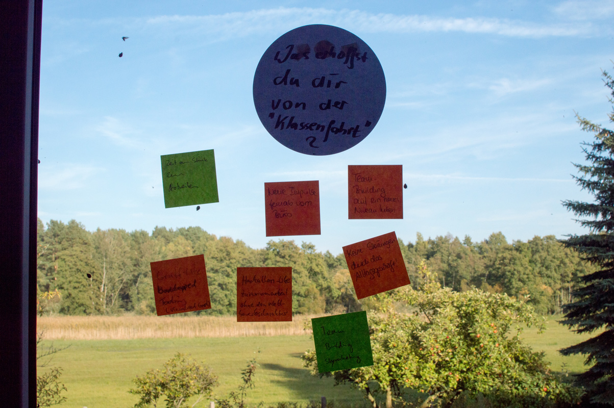
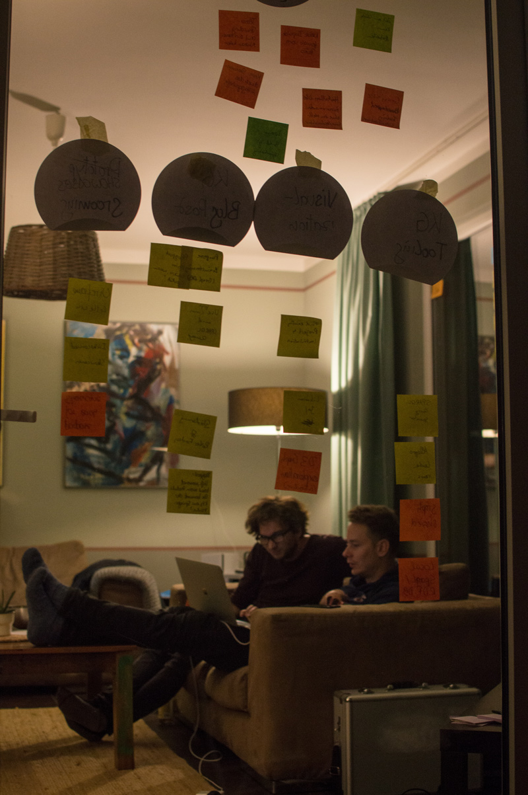

# 
# Ideas Engineering Hacksite

Schlagworte wie Workhacks, New Work und work-life-balance sind in aller Munde. Mit dem Ziel neue, das Gewohnte durchbrechende Ansätze für kreatives Arbeiten zu finden, hat das Team Enterprise der AS Ideas Engineering GmbH ein Experiment gewagt und ist eine Reise zu sich selbst angetreten.

## Was und Warum?
Der Grundgedanke dieser Reise liegt irgendwo zwischen einem [Offsite](http://www.harvardbusinessmanager.de/tipp-des-tages/a-1058194.html) und einem [Hackathon](https://de.wikipedia.org/wiki/Hackathon). Das Team hatte einige Themen auf dem Herzen, die es im täglichen Geschäft aus verschiedenen Gründen nicht in die Umsetzung geschafft hatten. Hier kam der Gedanke auf ähnlich eines Offsites sich für ein paar Tage außerhalb des bekannten Büros wegzuschließen und konzentriert an besagten Themen zu arbeiten. Der teambildende Aspekt dieses Unternehmens war ein weiterer Beweggrund. 

Alle Mitglieder waren sicher, dass ein Ortswechsel neue Energien und Ideen freisetzt, die das Team in den grauen Alltag mitnehmen kann. Täglich präsente Einflüsse wie zum Beispiel die Atmosphäre eines Großraumbüros werden radikal minimiert. Das Team kann im Stile eines Hackathons fernab von Bürozeiten und Meetings zusammenarbeiten. Dadurch soll es 
möglich sein Werte zu kreieren, welche im normalen Alltag wohl nicht umsetzbar gewesen wären. Drei Tage ausschließlich mit den gleichen Kollegen verbringen wird auch das Teamgefühl nachhaltig stärken.

<aside class="blogFootnote">
	
Was ist ein Hackathon?   Eine Veranstaltung, in der Regel mindestens einen Tag lang, bei welcher sich viele Teilnehmer zum gemeinsamen Software-Programmieren treffen.

	
Was ist ein Offsite?  Eine Veranstaltung, bei der Angestellte sich irgendwo abseits ihres Büros treffen um Arbeitsthemen zu bearbeiten bzw. teambildende Maßnahmen durchzuführen.

</aside>

## Der lange Weg zum Ziel
Abfahrt war an einem sonnigen Mittwoch sehr früh direkt vor dem Büro. In einem gemieteten Van fuhr das gesamte Team in Richtung Mecklenburg-Vorpommern. Das gesamte Team? Nein, zwei Teammitglieder nutzten die wohl letzten schönen Tage des Jahres um ihren Motorrädern noch ein letztes Mal die Sporen zu geben. Angekommen in der traumhaften Unterkunft [direkt am Neuwarper See](https://goo.gl/maps/qkVH4s6D2iD2) und der polnischen Grenze, ging es zunächst darum die Verpflegung für die kommenden Tage zu sichern. 
Als das Team vom Einkaufen zurückkam, fand es die Unterkunft im Belagerungszustand vor. Ein gigantischer Schwarm Marienkäfer ([Coccinellidae](https://de.wikipedia.org/wiki/Marienk%C3%A4fer)) hatte nahezu jede freie Gebäudefläche in Beschlag genommen und war leider auch zu Hauf durch nicht komplett geschlossene Fenster in die Räume gelangt. Nach dem gewonnenen Kampf gegen den Schwarm konnte das Team beim gemeinsamen Kochen schon eine deutlich tiefere Bindung aufbauen. 

# 

Im Anschluss an das Mittagsessen ging es in einer Session darum die Erwartungen jedes Einzelnen abzuholen und für die Gruppe transparent zu machen. Die Übersicht dessen war die komplette Zeit über deutlich sichtbar dargestellt und diente dem Team zur Ausrichtung ihrer Tätigkeiten. Anhand eines abgewandelten Modells des [Squad Health Checks](https://labs.spotify.com/2014/09/16/squad-health-check-model/) (SHC) wurde über die Zeit der Erfolg gemessen.  Dafür wurden die Aspekte: Mission, technische Qualität, passender Prozess, Spaß, Geschwindigkeit, Wert und Lernen am ersten sowie letzten Tag vom Team bewertet mit Hinblick auf die Reise im speziellen.
Den Rest des Tages und abends verbrachte das Team mit dem bearbeiten der in der vorherigen Session definierten Aufgaben.

<aside class="blogFootnote">
	<article>Was ist der Squad Health Check?  Der Squad Health Check ist ein von Spotify entwickeltes Umfragesystem um die Zufriedenheit der Mitarbeiter zu verschiedenen Themengebieten transparent darzustellen. Es hilft Unzufriedenheiten frühzeitig zu erkennen um gezielt gegensteuern zu können.     <a href="https://labs.spotify.com/2014/09/16/squad-health-check-model/">Spotify-Artikel zum Thema Squad Health Check</a>
	</article>
</aside>

# 

## Tag 2: Deutlich über 8h Fokus

Der mittlere Tag stand vollständig im Zeichen der fokussierten Arbeit. In verschiedenen Pairing-Kombinationen wurde auf Couchen und an Tischen konzipiert und entwickelt. Eine sehr lockere Atmosphäre mit Musik in einem Zimmer und vollkommener Ruhe in einem anderen Zimmer bot jedem die Möglichkeit mit hoher Effizienz an den Themen zu arbeiten. Die Abwesenheit täglicher Routinen ermöglichte es nach den eigenen Energien zu arbeiten. Die Pausen konnten mit Waldspaziergängen, Ruderfahrten oder gemeinsamen Kochen den Kopf sehr schnell freimachen. Dadurch ging auch das Gefühl für die Zeit verloren und die letzten Zeilen Code wurden kurz vor 2 Uhr fertig gestellt.

## Tag 3: Ergebnisse und Feedback

Am Freitagvormittag wurden die Themen nach einem reichhaltigen Frühstück finalisiert. So dass der Nachmittag der Reflektion dienen konnte.
Die Re-Evaluierung des angepassten Spotify Health Checks ergab eine Übererfüllung der Erwartungen für die meisten Kategorien. Die Mission und der Spaß bei dieser Reise waren so wie es sich das Team vorgestellt hat.

<table>
	<tr>
		<td></td>
		<td>Futurospektive</td>
		<td>Retrospektive</td>
		<td>Trend</td>
	</tr>
	<tr>
		<td>Mission</td>
		<td class="blogChart">
			
			&bull;&bull;
			&bull;&bull;&bull;
		</td>
		<td class="blogChart">
			
			&bull;&bull;
			&bull;&bull;&bull;
		</td>
		<td class="blogChart__ok blogChart">&#8594</td>
	</tr>
	<tr>
		<td>Spaß</td>
		<td class="blogChart">
			
			
			&bull;&bull;&bull;&bull;&bull;
		</td>
		<td class="blogChart">
			
			
			&bull;&bull;&bull;&bull;&bull;
		</td>
		<td class="blogChart__ok blogChart">&#8594</td>
	</tr>
	<tr>
		<td>Passender Prozess</td>
		<td class="blogChart">
			
			&bull;&bull;&bull;
			&bull;&bull;
		</td>
		<td class="blogChart">
			
			&bull;&bull;
			&bull;&bull;&bull;
		</td>
		<td class="blogChart__good blogChart">&#8599</td>
	</tr>
	<tr>
		<td>Technische Qualität</td>
		<td class="blogChart">
			
			&bull;&bull;&bull;&bull;
			&bull;
		</td>
		<td class="blogChart">
			
			&bull;
			&bull;&bull;&bull;&bull;
		</td>
		<td class="blogChart__bad blogChart">&#8595</td>
	</tr>
	<tr>
		<td>Lernen</td>
		<td class="blogChart">
			
			&bull;&bull;&bull;
			&bull;&bull;
		</td>
		<td class="blogChart">
			
			&bull;&bull;
			&bull;&bull;&bull;
		</td>
		<td class="blogChart__good blogChart">&#8599</td>
	</tr>
	<tr>
		<td>Wert</td>
		<td class="blogChart">
			&bull;
			&bull;&bull;
			&bull;&bull;
		</td>
		<td class="blogChart">
			
			&bull;&bull;&bull;
			&bull;&bull;
		</td>
		<td class="blogChart__good blogChart">&#8599</td>
	</tr>
	<tr>
		<td>Geschwindigkeit</td>
		<td class="blogChart">
			&bull;&bull;
			&bull;&bull;&bull;
			
		</td>
		<td class="blogChart">
			
			&bull;&bull;&bull;&bull;
			&bull;
		</td>
		<td class="blogChart__good blogChart">&#8599</td>
	</tr>
</table>
 

Der Prozess (die Reise an sich) hat die Erwartung leicht übertroffen. Die Geschwindigkeit ist in der Wahrnehmung des Teams deutlich gestiegen. 

Die größte Uneinigkeit herrschte am Anfang beim Thema Wert. Auch dieser Punkt hat nach dem Betrachten des Erreichten einen deutlichen Schub ins positive bekommen.
Die Hoffnung einer deutlichen Steigerung der technischen Qualität hat sich als einziges nicht bestätigt. Dies korreliert mit einem deutlichen Fokus auf Stabilität während der Tage. 

Bei einer Walk-And-Talk Retrospektive entwickelte die Gruppe einige Ideen wie die Erfahrung bei einer definitiv stattfindenden Wiederholung weiter optimiert werden könnte. 
Das Ergebnis zeigte hauptsächlich organisatorische Optimierungen:
 * Um die Zusammenarbeit weiter zu optimieren sollte das nächste Mal auf bessere/mehr technische Werkzeuge geachtet werden (Netzwerkkabel, Tastaturen, Mäuse, Monitore). 
 * 2-3 Stunden Fahrt haben eine gehörige Portion der zur Verfügung stehenden Zeit gefressen. Eine etwas kürzere Anreise würde dem Rechnung tragen. 
 * Die Zeit vor Ort kann noch effizienter genutzt werden. Dies wäre zum Beispiel durch regelmäßige Synchs möglich oder durch die Fokussierung des ganzen Teams auf ein bestimmtes Ziel (z.B. ein Prototyp o.ä.)
 * Es wäre toll ein nicht technisches Seitenprojekt während des Ausflugs ebenfalls zu bearbeiten

 

<aside class="blogFootnote">
	<article>
		Was funktioniert das Konzept Walk-and-Talk?  Das Format Walk-and-Talk ermöglicht es, in einem persönlichen Gespräch über die gewöhnliche Intensität hinaus in Themen einzutauchen. Der Ablauf ist relativ simpel:  Die Gruppe teilt sich in Paare auf. Jedes Paar geht für sich spazieren und unterhält sich nach einem bestimmten Ablauf. In den ersten fünf Minuten spricht nur eine Person des Paares. Ihr Partner hat die Rolle des aktiven Zuhörers. Nach den ersten fünf Minuten werden die Rollen für ebenfalls fünf Minuten getauscht. Im Anschluss kann das Paar im offenen Dialog weiter über das soeben gesagte reden.   Durch die erzwungene Einseitigkeit des Gesprächs wird der Erzählende ermutigt tiefer in die Materie einzutauchen und profundere Erkenntnisse zu teilen.
	</article>
</aside>

## Fazit

Das Abschließende Fazit fällt durchgehend positiv aus. Die „Klassenfahrt mit Arbeitsbezug“ hat sich als durchschlagender Erfolg erwiesen. Die Stimmung im Team und die Verbindung untereinander ist deutlich gestiegen. Die erwarteten Ergebnisse konnten geliefert und in den Alltag integriert werden. Die Abwesenheit der gewohnten Normen hat die Gruppe zu noch intensiverer agiler Organisation geführt.

# 

Die lose Verknüpfung eines Offsites mit Elementen eines Hackathons und verschiedener Teambuilding-Maßnahmen ist daher uneingeschränkt zu empfehlen.

# 
