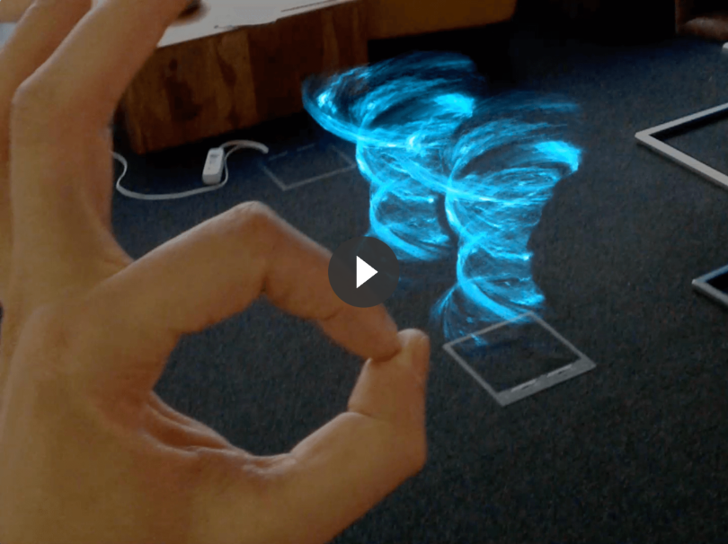
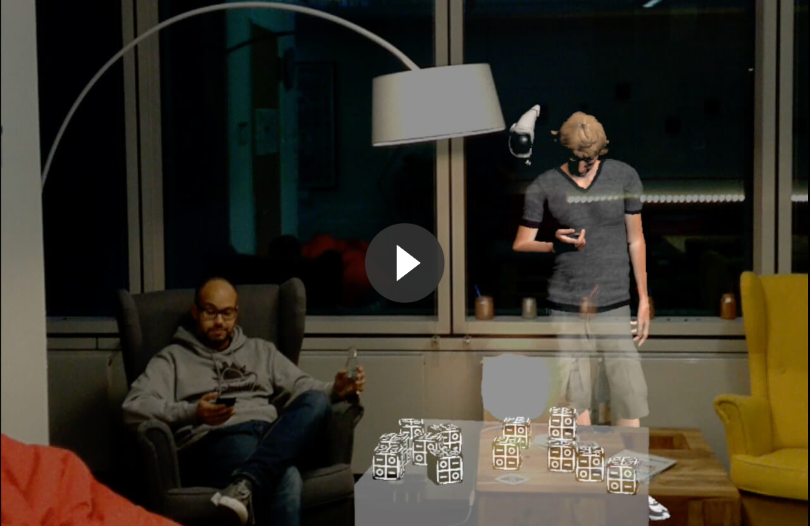
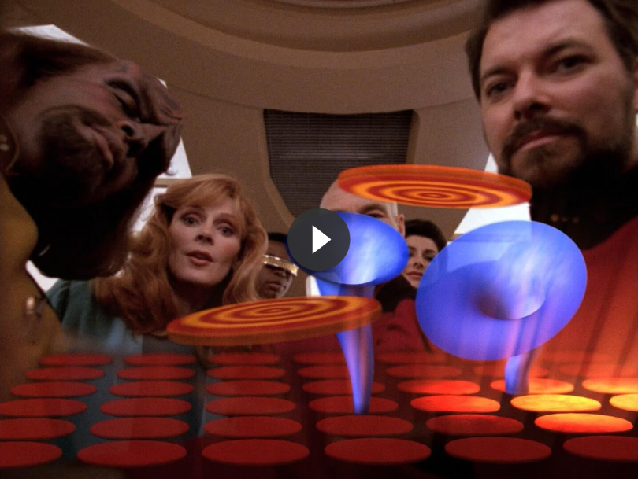
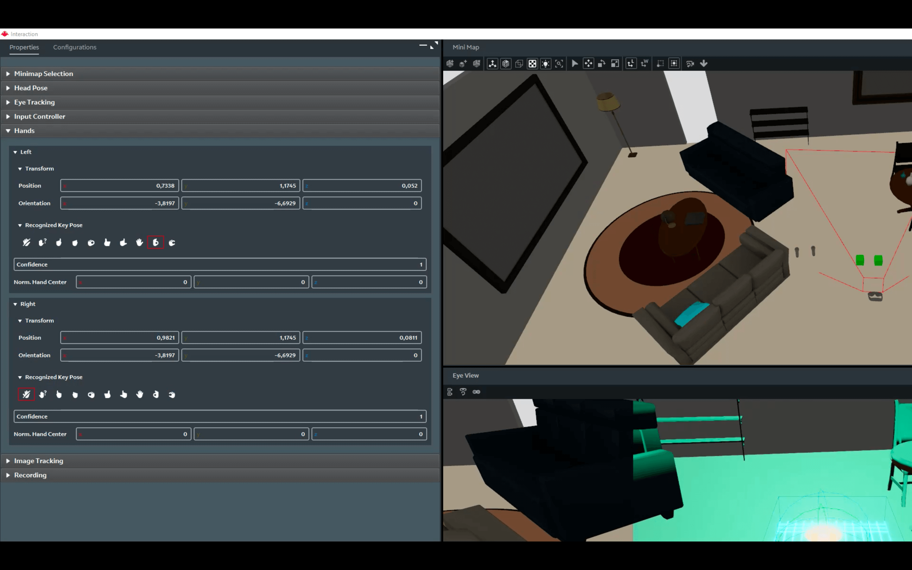
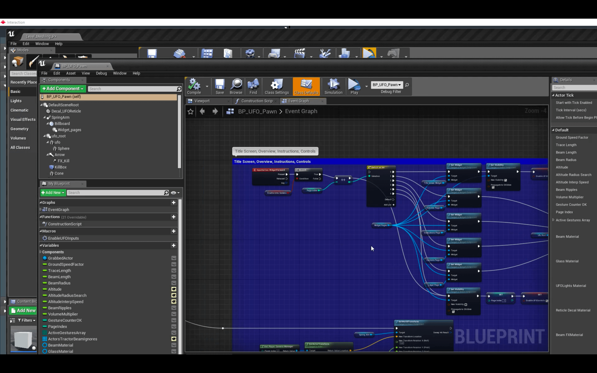

 
# Hello Magic Leap

Vor ein paar Wochen waren meine Kollegen Marcel und Tarek in Los Angeles auf der Magic Leap Developer Conference. Ihr Geheimauftrag: Eine Magic Leap Creators Edition zu uns nach Deutschland zu holen. Die Mission war erfolgreich und wir konnten es kaum erwarten, unsere ersten "Leaps" damit zu machen. Die installierten Apps sind beeindruckend. Mit der "Create" App beispielsweise lässt sich unser Büro mit kleinen kämpfenden Ritter, Astronauten und Riesenschildkröten besiedeln. Ein kleines fliegendes Ufo entführt die putzigen Lebewesen und räumt hier wieder auf. Die Magic Leap erschafft eine inversive Erfahrung in der man sich intuitiv wohl fühlt.

VR - AR - Magic Leap. Virtual Reality erschafft eine künstliche Welt, in die man eintauchen kann. Augmented Reality setzt zusätzliche Erfahrungen auf unsere echte Umgebung. Magic Leap lässt die Grenzen verschwimmen und die digitalen Inhalte, die Welt und uns miteinander interagieren. Das ist der Claim des Herstellers. Doch nun genug der Werbeparolen, legen wir los. Wie arbeitet unser Team? Wir sind Innovatoren für Axel Springer. Unsere Zeit mit der Brille bettet sich in unseren Innovationsprozess ein (dazu wird es einen anderen Post geben), in dem 1-Wochen Prototypen entstehen. Doch vor dem ersten Prototypen haben wir ein paar Tage Zeit, um die Basics zu meistern: Wir kämpfen uns durch Tutorials, SDK Versionen, Code, kompilieren den Unreal Editor mit Magic Leap Support aus 106,000 Quelldateien, verkabeln die Magic Leap korrekt, erstellen Zertifikate und lernen das MLDB Konsolenprogramm kennen. Am Ende sind wir in Lage, ein eigenes kleines Programm zu entwickeln, auf die Magic Leap zu deployen und ein Video aufzunehmen.

# The Game

Jetzt ist die Zeit reif für den ersten MR Prototypen. Ideen dafür gibt es viele aus den Reihen der Ideas Engineering. 5 Ideen haben es in unser Innovation Backlog geschafft. Wir bewerten und sortieren die Ideen nach der Schwierigkeit der Umsetzung. Unser erstes Projekt: [The Game](https://en.wikipedia.org/wiki/The_Game_(Star_Trek:_The_Next_Generation)). Inspiriert von der gleichnamigen Star Trek: The Next Generation Folge (Season 5, Episode 6). Commander Riker bringt das Spiel von einem Urlaub auf dem Planeten Risa mit und schon bald ist die gesamte Besatzung süchtig danach. Uns motiviert das Spiel zwei Fähigkeiten im Umgang mit der Magic Leap zu lernen: Aufzeichnung und Interaktion mit dem Mesh, welches den echten Raum um uns herum beschreibt. Und die Verwendung von Handgesten als Interaktionsmöglichkeit.

# Der Simulator - Zero Iteration

Sehr bald wird uns klar, dass es sehr aufwändig ist, jede Iteration der Software direkt auf der Magic Leap zu testen. Das war auch den Entwicklern in Florida klar und so enthält das Software Development Kit einen Simulator. Darin lassen sich kinderleicht virtuelle 3D Räume mit Wänden, Tischen, Türen und Objekten erstellen, mit dem die Meshing Funktion unseres Spiels gefüttert wird. Natürlich kann man sich in der Simulation bewegen und umsehen. Auch Handgesten können vom Simulator bequem an unsere Anwendung geschickt werden. Diese Zero-Iteration durch den Simulator ist unglaublich wertvoll. Doch die Inbetriebnahme des Simulators war für uns nicht ganz geschmeidig. Zuerst mussten wir die Nvidia Graphiktreiber auf eine ältere Version zurücksetzen, und bei der Eingabe der Handgesten wurden wir anfangs auf einen toten Pfad geschickt. Einige dieser [Fallstricke](#pitfalls) listen wir am Ende dieses Artikels.

# Entwicklung für die Magic Leap

Für die Entwicklung eigener Magic Leap Anwendungen stehen die 3D Riesen Unity und Unreal bereit. Es kann auch nur mit dem Magic Leap SDK Lumin entwickelt werden, doch muss man dann auf viel verzichten. Möchte man allerdings eine Hintergrund App entwicklen, so ist Lumin das Werkzeug der Wahl. Wir entscheiden uns für die Unreal Engine, da wir damit bereits [einige Erfahrung](https://www.youtube.com/watch?v=ZygimW2oNtw) im Team haben. Wer die Spiele- und VR Entwicklung mit Unreal kennt weiß sicherlich, dass man unglaublich viel gestalten kann, ohne eine Zeile Code in C oder C++ zu schreiben. Dafür beschäftigt man sich umfangreich mit Assets, Models, Materials, Shader und Blueprints, die nicht minder komplex werden können.

Für unser "The Game" suchen wir nach passenden Tutorials und Beispielanwendungen. In der "Abductor" App aus dem Creators Bereich werden wir fündig. In dem Spiel steuert man ein kleines Ufo, mit dem man eine Anzahl an Space Kitties entführen muss. Diese werden zu Beginn des Spiels mittels der "Ok" Geste an eine passende Stelle des Raums platziert. Das Ufo wird mit dem Touchpad des Controlles gesteuert und bewegt sich etwa 50cm über dem Boden. Navigiert man das Ufo über eins der Space Kitties, wird es mit dem Traktorstrahl entführt. 

Das Spiel hat was wir brauchen. Die Platzierung der Spielfläche im Raum hatten wir uns zum Lernen als Variation des Star Trek Spiels überlegt, und die Interaktion mit der "Ok" Geste erfüllt unser zweites Lernziel. Die Steuerung des Ufos kommt der Gedankensteuerung von Star Trek schon ein bischen nahe. Zwischenzeitlich hatten wir auch ein Werfen der Scheibe wie einen Diskus mit der Hand im Blick. Marcel zaubert aus dem Ufo eine gelb leuchtende Scheibe. Die Kitties ersetzen wir mit einem Wirbelsturm aus dem kostenlosen <a href="https://www.youtube.com/watch?v=t4Ag_qlQG20" target="_blank">Advanced Magic FX 13</a> Paket. Leider ist das Asset nicht für die spezielle Magic Leap Version freigegeben. Beim Export/Import gehen wichtige Verknüpfungen der Materialen des Partikelsystems verloren. In mühseliger Kleinarbeit aber stellen wir diese wieder her und lernen eine Menge. Eine Kollision der Scheibe mit dem Wirbelsturm schließlich bringt diesen zum Verschwinden und das Spiel zu seinem Ende. Und die Woche ist rum.

# Fazit

Es ist kaum vorstellbar, das jemand, der die Magic Leap One einmal getragen hat, nicht daran glaubt, dass MR ein Medium mit Zukunft und unglaublichem Potential ist. Klar, jetzt ist das Gerät noch nicht bereit für den Endkunden, wäre mit 2200$ zu teuer, der eingeschränkte Sichtbereich ist zu klein und die Werkzeuge vertragen noch etwas Feinschliff. Das wird sich aber in absehbarer Zeit lösen lassen. Und die Möglichkeiten für Unterhaltung und Industrie sind riesig. Gut möglich, dass MR sogar mal ein Teil unseres Alltags wird. Mobiltelefone sind es auch geworden. Würde man deshalb mit einer digitalen Brille aus dem Haus gehen? Vielleicht. Aber das könnte in 10 - 20 Jahren auch gar nicht mehr notwendig sein. Wir werden es erleben...

# Fallstricke
Zum Abschluss eine kleine Liste an Fallstricken, deren Überwindung uns Zeit gekostet hat, die ihr vielleicht einsparen könnt.

- Der Controller wird [elektro-magnetisch geortet](https://www.tomshardware.com/news/magic-leap-controller-fcc-specs,37344.html) und geht in der Nähe von Elektronik verloren (z.B. Fernseher, bei uns der verkabelte Boden)
- Simulator: Nvidia Treiber Downgrade auf Version 399.07
- Simulator: Keine weitere VR Hardware an den Computer angeschlossen
- Simulator: Key-Binding Gesten funtionieren anders (und in unseren Beispielen somit nicht) als die "Recognized Key Pose"

