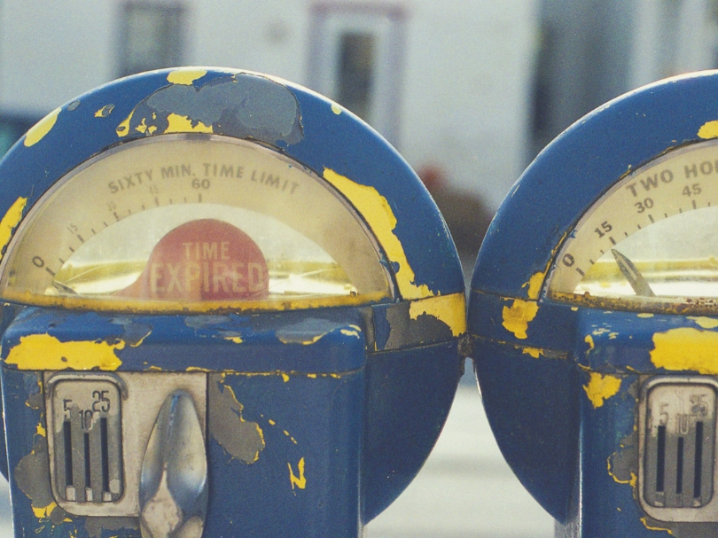
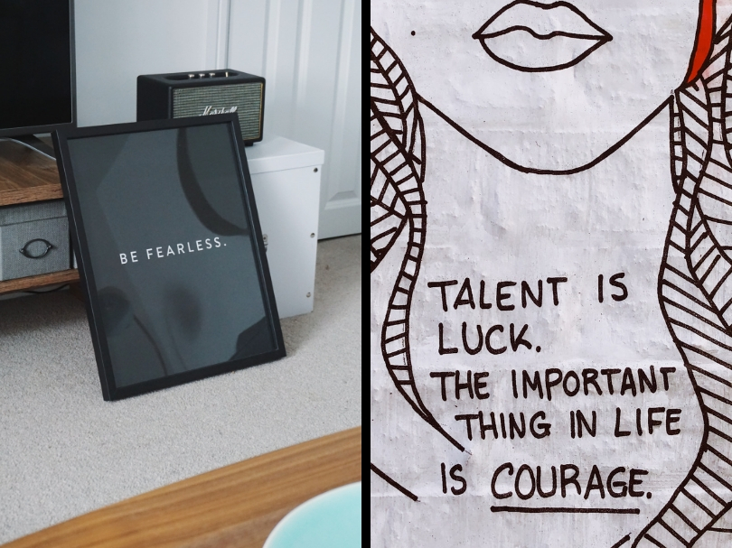
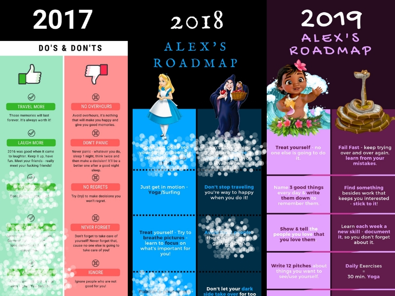
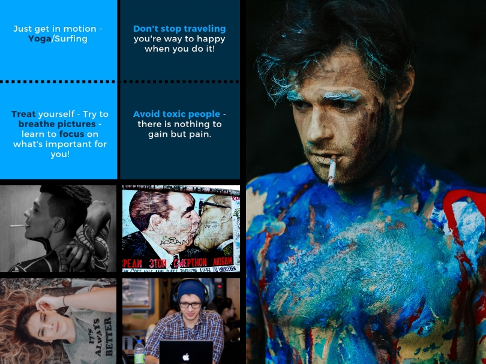

# 2019 A New Year Resolution Experiment

2019 is quite close & people are starting to contemplate whether 2018 has been a good or a bad year. This year has been a good year for me. It started out with my New Year Resolution & I’ve been motivated to tackle those todos ever since.

This article is about what I learned the past two years making up my News Years Resolution lists.

## Use SMART Resolutions
Rather than being vague use very specific & measurable goals. You’ll be able to keep better track of them, so whenever you achieve one of your goals you can check it off your list. Only set goals that are relevant or you’ll be finding yourself ignoring them after the first month or so. Why would you put time into achieving something that is not relevant & so you’ll realize that your time is being spent well on another behalf. Since time is of the essence you also should make sure that if you want to achieve one of your goals by a specific time, you ought to make it time-bound. This way you’ll have a two dimensional goal.

## Make Them Visible
In order to get used to your New Year Resolution goals you should display them at home &/or work. This way you’ll be able to check back & remind yourself of what you want to achieve. If you just shove them in one of your drawers you’ll soon forget about them - this way you can be sure to never succeed when it comes to New Year Resolutions. So keep them visible - & if you wanna go full commitment - get a tattoo ;-)

## Address Both Demons
When phrasing my goals over the last three years I found it more effective to address both of my demons. I chose to use both formulations: do something & don’t do something. Imagine to follow your list all year long solely consisting of DON’Ts...This might get quite negative soon & for the sake of psychological impact you should keep in mind that working on positive amplification is way more healthy on a long term.

## Active vs. Passive Verbs
As for the motivational part - I always feel more motivation when using active verbs & literally highlighting them. Whenever I check back with my list I feel like instantly grasping the very essence of each entry & it sticks to my mind quite simply.

## Tailor Them To Your Personality
The secret to keep up motivation to follow through with your New Year Resolution list is...Make it your list. It doesn’t make sense to go copy random goals from the internet. Those won’t give you the relevance (remember smaRt). There are generic goals you might want to follow like *Give up smoking* but when, how & within which time frame should be something tied to your personality & needs.

## Just Do It
I’ve been working on my own New Year Resolution during the Xmas Holidays & since I learned from the last two, I created a list more specific than the others before. I figuratively kept a close eye on my phrasing & tried to make it as challenging as I can without putting myself in the position of quitting before I even started. In the end each year is a new beginning & I want to leave my comfort zone in order to enter the learning zone.

## What Lies Ahead
I wish you good fortune with setting your goals & an awesome new beginning & as Gusteau (Ratatouille) said: “If you focus on what you’ve left behind, you will never be able to see what lies ahead.”

