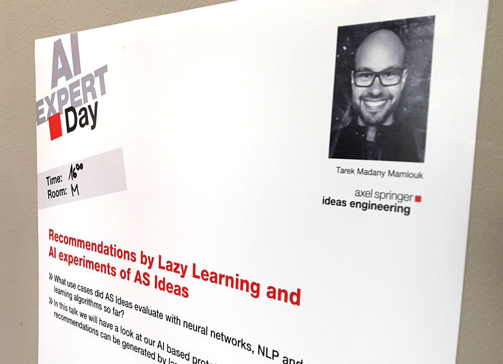
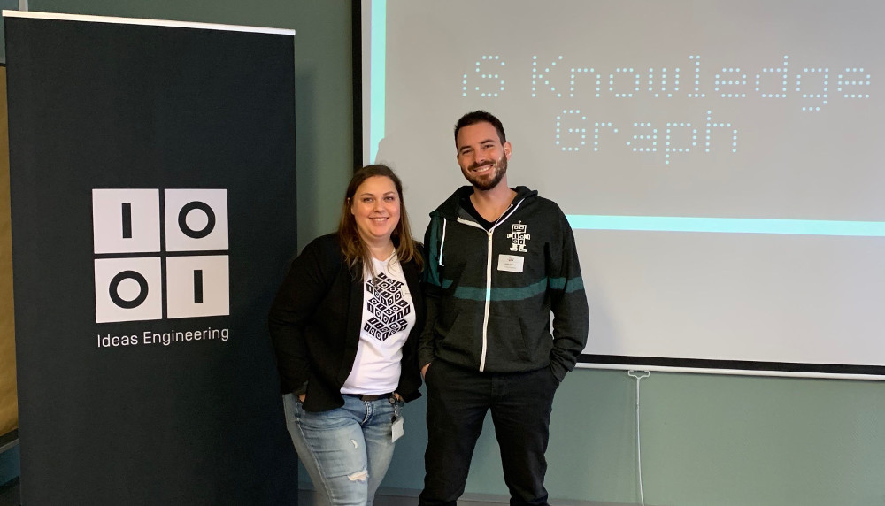
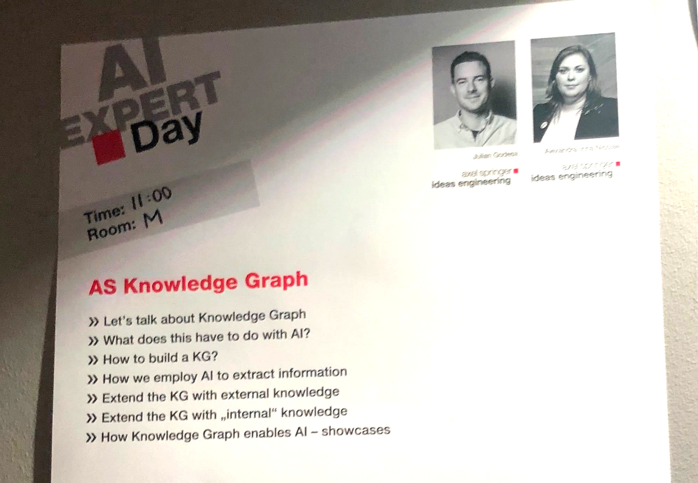

# AI Expert Days

Axel Springer veranstaltet regelmäßig die sogenannten „Expert Days“ an denen die Experten eines Themenbereichs aus der Axel Springer Familie zusammenkommen und sich austauschen. Auf den letzten beiden AI Expert Days in 2018 waren auch wir mit unseren AI relevanten Themen dabei. 

Unser Team Edison baut im Wochenrhythmus Prototypen als PoC und dabei berühren wir neben Blockchain und VR auch viele Disziplinen der AI. Genau damit bewarben wir uns um einen Slot beim AI Expert Day im letzten April. Unter dem Oberbegriff „Content Intelligence“ erarbeiteten wir Ansätze vom semantischen Fingerabdruck über Plagiatsanalyse bis zur KNN basierten Recherchehilfe. Mit unseren 1-Wochen-Prototypen machen wir keine Grundlagenforschung oder entwickeln neue Technologien aber wir machen existierende Ansätze greifbar, ausprobierbar und stellen kreative Ideen vor, diese in den Units einzusetzen. Über einen dieser Prototypen schrieb ich im März bereits einen Blogartikel: 
[https://axelspringerideas.de/blog/2018/03/lazy-learning-per-knn/](https://axelspringerideas.de/blog/2018/03/lazy-learning-per-knn/)

Das Thema, mit dem wir bisher das größte Interesse bei unseren Zuhörern gewannen, war der semantische Fingerabdruck. Unsere These war, dass wir den Inhalt eines Nachrichtenartikels mit Hilfe eines „Fingerabdrucks“ identifizieren können und damit andere Artikel, die den gleichen oder sehr ähnlichen Inhalt haben, vergleichen und erkennen können. Bei unseren Experimenten merkten wir, dass der semantische Fingerabdruck relativ zuverlässig Plagiate erkennen konnte obwohl das gar nicht unsere Intention gewesen ist. Wir übertrafen damit sogar die Ergebnisse unseres dedizierten Plagiatserkennungsprototypen, der auf Basis syntaktischer Merkmale arbeitete.

Unser Auftritt auf dem AI Expert Day war schwierig, da wir keinen der AI Experten mit revolutionären Technologien oder weltbewegenden Erfindungen überraschen konnten. Der Aspekt, der uns hier jedoch einmalig machte, war unser Innovationsprozess mit seinen kleinen Iterationen, in denen wir uns durch die Prototypen arbeiten und neue Anwendungsfälle für unser aufgebautes Wissen finden und den Units verfügbar machen. 

Auf unserem zweiten AI Expert Day im Dezember 2018 bekamen wir auch wieder einen Slot und hatten diesmal ein inhaltlich tieferes Thema. Unser Team Enterprise entwickelt einen Knowledgegraph zur inhaltlichen Verknüpfung der Inhalte unserer Units. Der Aufbau des Knowledge Graphen ist sowohl technisch als auch fachlich anspruchsvoll und wurde bisher auch noch von keiner Unit in Angriff genommen. So konnten wir auf dem AI Expert Day zeigen, dass Ideas Engineering auch AI Disziplinen direkt in Produkte umsetzen kann.

Ich bin gespannt, ob wir uns ab jetzt auf jedem AI Expert Day platzieren können. Unser Backlog ist voll und der Markt explodiert mit AI-basierenden Technolgien. Falls ihr zu Technologietrends und Technologienachrichten auf dem Laufenden bleiben wollt, abonniert gerne unseren Newsletter: 

[Ideas Engineering Tech Review](https://axelspringerideas.us13.list-manage.com/subscribe?u=d4ff5f1c1f7d849d773d43835&id=03f432ed25)

Hier berichten wir wöchentlich von den spannendsten Schlagzeilen der Technologiewelt.
