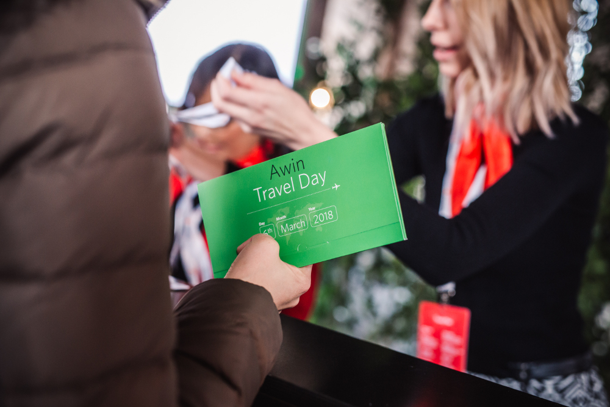
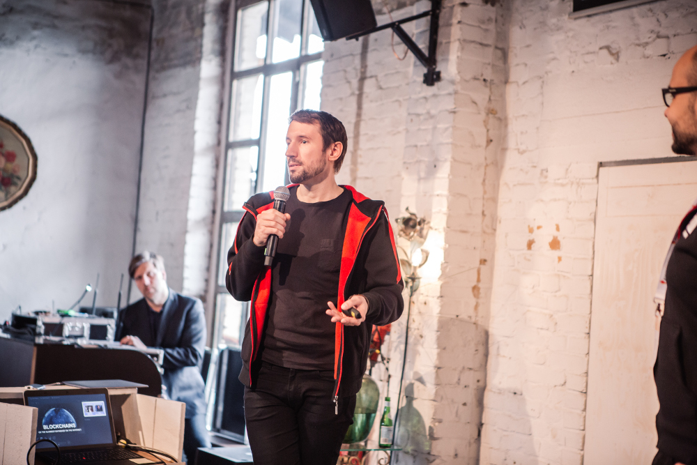
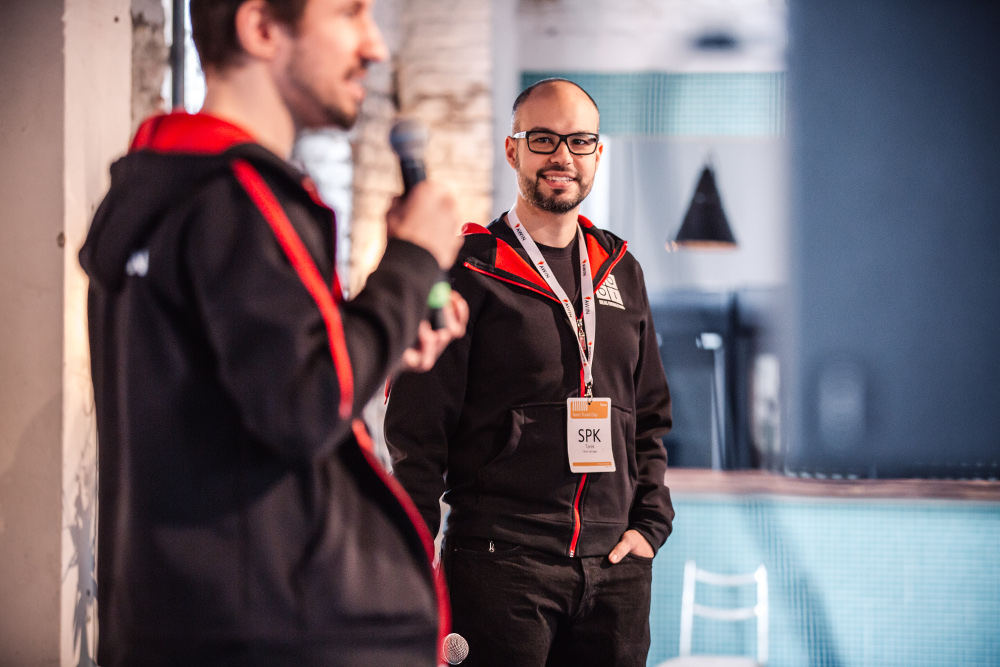

# Awin Travel Day

Manche Blogbeiträge bleiben länger im Backlog liegen als sie es verdienen denn der Awin Travel Day war bereits im März dieses Jahres. Was hat Ideas Engineering mit dem Awin Travel Day zu tun? Wir waren dabei und zwar nicht nur als Zuhörer, sondern als Experten für Blockchain in Business Applications. 

Januar 2018 war unser Blockchain-Monat. „Blockchain“ und „Smart Contracts“ waren in den Google Statistiken auf einem Langzeithoch und die ganze Welt staunte über die wahnsinnige Entwicklung der Bitcoinpreise. Damit war es für uns bei Ideas Engineering natürlich Pflicht Blockchains zu studieren und zu evaluieren wie sich Blockchains sinnvoll einsetzen lassen. Um Blockchains und Smart Contracts zu verstehen begannen wir mehrere Prototypen zu bauen wobei unser Fokus auf Ethereum und Solidity lag. Wir begannen mit kleinen selbstgebauten Blockchains und endeten bei cloudbasierten, öffentlichen Ethereum Knoten auf denen unsere Contracts liefen. Wir bauten Zeiterfassungswerkzeuge, unitgetestete Arbeitsverträge und einen Credibility Score für Nachrichtenartikel. Das war keine schlechte Ausbeute für einen Monat.

Wir präsentierten unsere Ergebnisse auf verschiedenen Veranstaltungen und wurden schnell als die „Blockchain Bude“ bekannt, bei denen alles nur noch Blockchain ist. Dies war selbstverständlich ein sehr zweifelhafter Ruf, da der Hype um Blockchain sehr viel Schall und Rauch mitbringt und auf dem Markt für viel Müll sorgt. Teil unserer Talks war auch immer die Warnung NICHT alles mit Blockchain zu bauen, da es in den meisten Fällen überhaupt keinen Sinn macht.

Ich hatte mich unglaublich gefreut als eines Tages mein Telefon klingelte und Awin anfragte, ob wir nicht im Rahmenprogramm des Awin Travel Days auftreten wollten und den Travel-Experten Blockchain als Technologie und die Anwendung in der Reiseindustrie vorstellen wollten. Das war für uns eine perfekte Gelegenheit die Brücke von unseren experimentellen Prototypen zu echten Anwendungsfällen in der Wirtschaft zu schlagen also sagten wir selbstverständlich sofort zu. Sebastian „Waschi“ Waschnick und ich waren beim Präsentieren von Blockchains inzwischein ein eingespieltes Team und hatten viel Spaß damit die Menschen nicht nur aufzuklären, sondern auch zu unterhalten

Da wir nicht mit Techies sondern mit Business-Menschen zu tun hatten, öffneten wir mit einer allgemeinen Einführung in die Welt von Cryptowährung am Beispiel von Bitcoin. Es war eine echte Herausforderung nicht zu technisch zu werden als wir versuchten die Funktionsweise einer Blockchain zu erklären, da das Fundament sehr viel mit Mathematik und Cryptographie zu tun hat. Der kritische Teil unseres Talks war vermutlich der Überblick über die Firmen, die versuchen mit Hilfe von Blockchains und Smart Contracts den Markt umzukrämpeln. In vielen Fällen wird Blockchain nämlich als disruptive Technologie präsentiert, die die großen Spieler mit einem Schlag vom Markt fegen wird. 

CryptoCribs ist eine Plattform, die sich als potentieller Killer für Airbnb sieht. Mit Smart Contracts ist es möglich eine sichere Vereinbarung zwischen Mieter und Vermieter zu treffen, sodass kein Mittelsmann mehr gebraucht wird und daher auch keine Gebühr an einen Mittelsmann abgetreten werden muss. Damit wäre Airbnb überfüssig. Dieses Beispiel lässt sich auf jedes Business abbilden, deren Leistung in der Vermittlung zwischen Kunden und Hotels, Fluggesellschaften, oder Mietautos besteht. Andere vielversprechende Blockchain-Firmen sind Winding Tree, Civic und Loyyal, die alle mit Hilfe von Blockchains die Reiseindustrie sicherer, preiswerter und unkomplizierter machen wollen. Unsere Empfehlung an die Gäste des Travel Days war es die neue Blockchain Welt zu verstehen und die Ansätze wo auch immer es Sinn macht zu adaptieren um sich der neuen Welt anzupassen und sich nicht ablösen zu lassen.

Ob und wann Vermittler tatsächlich komplett von Smart Contracts abgelöst werden, ist schwer vorherzusehen. Viele Benutzer verstehen noch nicht was Blockchain bedeutet und wissen nicht ob diese Technologie mehr oder weniger sicher als die altbekannten Dienstleister ist. Außerdem gibt es ein Gefühl der Sicherheit im Konfliktfall mit einem Mitarbeiter des Vermittlers sprechen zu können. Dieses ist die Leistung, für die der Anbieter seine Gebühr nimmt. Es wird sich zeigen, welcher der Ansätze sich durchsetzen wird oder ob sich der Markt möglicherweise einfach teilen wird und beide Plattformen ihre Daseinsberechtigung haben werden. 
