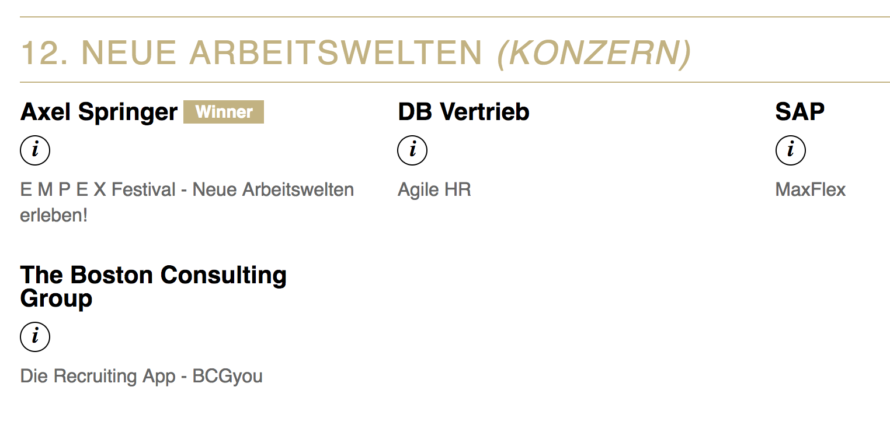
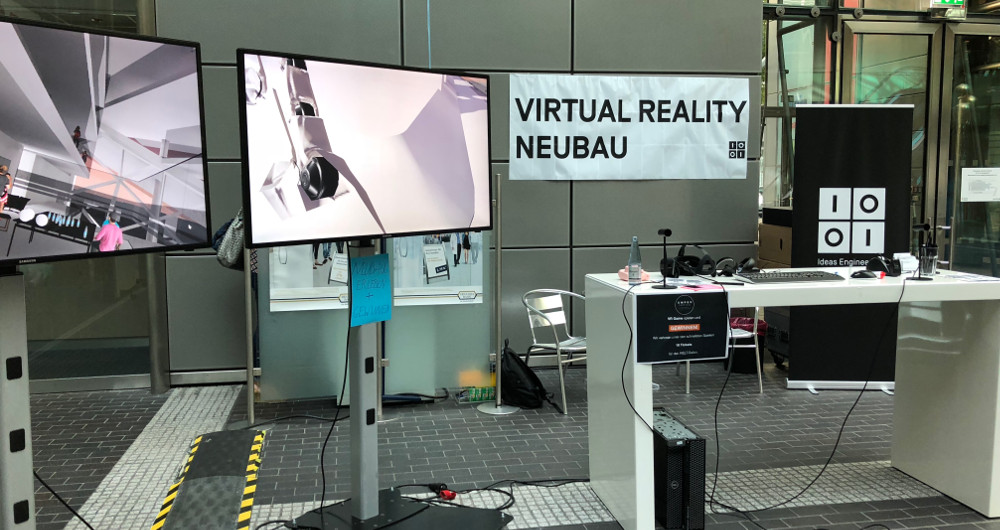
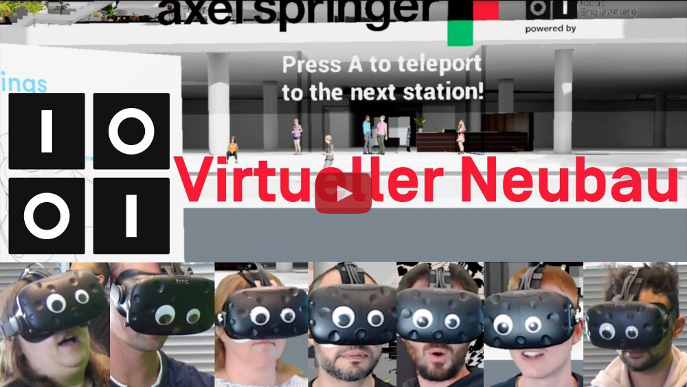
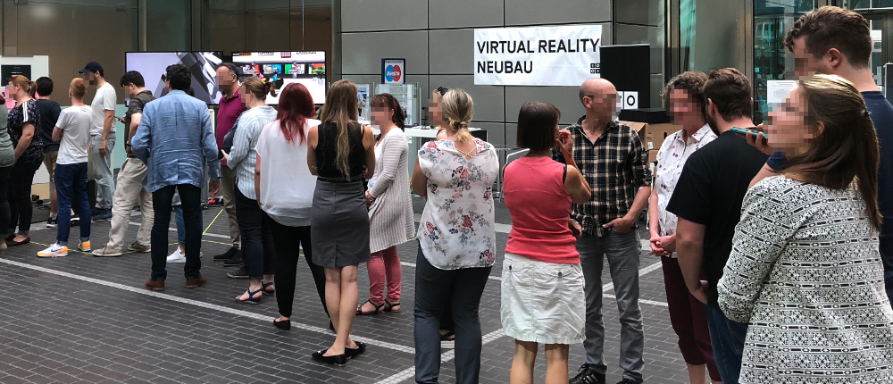

# HR Excellence Award 2018

Axel Springer gewann vor kurzem den HR Excellence Award 2018 in der Kategorie „Neue Arbeitswelten (Konzern)“. Wir bei Ideas Engineering haben uns besonders darüber gefreut, nicht nur weil wir Teil der Axel Springer Familie sind, sondern weil wir einen wichtigen Beitrag zu diesem Award geleistet haben. 

[https://www.hr-excellence-awards.de/best-of-2018/](https://www.hr-excellence-awards.de/best-of-2018/)

Den Preis haben wir für das EMPEX (EMPloyer EXperience) Festival bekommen, das diesen Herbst über alle Standorte verteilt stattfand. Die Firmen von Axel Springer präsentierten mit welchen Arbeitskonzepten wir unseren Mitarbeitern ein modernes und fortschrittliches Arbeiten ermöglich und auch wie wir in der Zukunft arbeiten werden. Einer der Schwerpunkte des Festivals war die Planung und Konzeption des neuen Axel Springer Gebäudes, das 2019 fertiggestellt wird und 2020 bezogen wird. Im Rahmen des Festivals gab es Führungen durch den Rohbau, Präsentationen zum Innenraumkonzept und natürlich als Höhepunkt: Eine virtuelle Führung durch das fertige Gebäude mit Hilfe von Virtual Reality.

Hier kamen wir ins Spiel. In den vergangenen Monaten bauten wir mehrere Prototypen in VR. Eines unserer ersten Experimente war, den Axel Springer Neubau begehbar zu machen. Eine simple Version hiervon hatten wir nach 2 Wochen fertig und bewiesen damit, dass ein solcher VR Prototyp mit überschaubarem Aufwand machbar ist. Die Nachricht, dass Ideas Engineering einen solchen Prototyp baute, machte schnell die Runde und bald schon saßen wir mit People & Culture zusammen um aus diesem Prototypen ein echtes Eventerlebnis zu machen. 

Das Konzept war ein Messestand an dem Besucher mit Hilfe eines VR Headsets eine moderierte, virtuelle Führung durch den Neubau bekommen und dabei einen Eindruck über unseren zukünftigen Arbeitsplatz bekommen. Neben der virtuellen Führung bauten wir auch ein kleines Spiel mit ein bei dem der Besucher 3 Minuten Zeit bekommt um möglichst viele „Axel Springer Münzen“ im Neubau zu finden und einzusammeln. Jede Münze trägt dabei das Logo einer Axel Springer Marke wie z.B. Idealo, Stepstone oder Ideas Engineering. Unter den schnellsten Spielern wurden zum Ende des Festivals 10 Tickets für den Welt-Heißluftballon verlost.

Für uns war der VR-Neubau ein fantastisches Projekt um Erfahrungen mit Unreal4, 3D-Modellen und VR-Softwareentwicklung im Allgemeinen zu sammeln, für Axel Springer war es ein Baustein für den HR-Excellence Award 2018.
