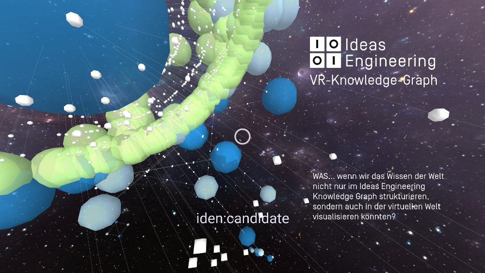
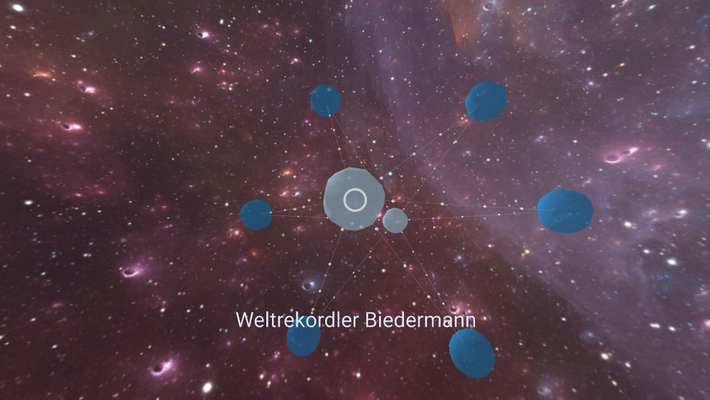
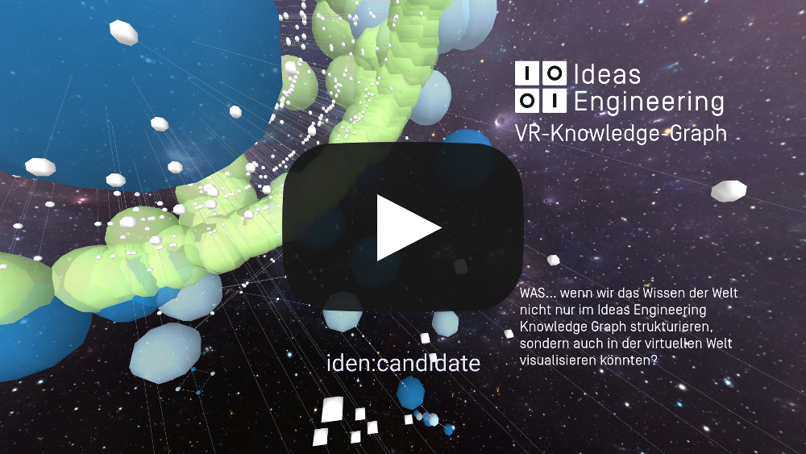

# VR-Knowledgegraph

Im letzten Blogbeitrag berichtete ich von den AI-Expert-Days auf denen wir unseren Ideas Engineering Knowledgegraph vorstellten. Da wir gerne auch mal über den Tellerrand hinüberschauen, landete in unserem Innovation-Funnel der Pitch, den Knowledgegraph auch "virtuell erlebbar" zu machen. Also bauten wir einen Prototypen für einen VR-Knowledgegraph.

Ansich hatten wir alles was wir brauchen um unseren Knowledgegraph in VR darzustellen: Eine erste Version des KG mit REST API hatte Team Enterprise bereits zu laufen und Team Edison brachte das Grundwissen für VR Entwicklung mit. 

Da wir das ganze per Web verfügbar machen und die Inhalte dynamisch nachladen wollen, entschieden wir uns für eine Applikation, die sowohl im Browser als auch auf VR Headsets laufen kann. Das W3C hat mit der Immersive Web Working Group bereits eine erste Version von WebXR ausformuliert, die alles mitbringt was wir brauchen. Also recherchierten wir was ThreeJS und A-Frame uns anbieten um den Knowledgegraph zu visualisieren. Wir haben mit diesen Frameworks zwar noch keine 100% Browserabdeckung aber das ist bei einer als "unstable" deklarierten Version einer API auch nicht anders zu erwarten.

Davon ließen wir uns aber nicht stoppen, denn unsere Tests zeigten, dass wir zumindest im Desktop-Firefox, in der Oculus Go und auf den Highend Headsets HTC-Vive und Oculus Rift unsere browserbasierten Visualisierungen abspielen konnten. Da wir nur 1 Woche Zeit für den Prototyp hatten, konzentrierten wir uns auf das Wesentliche und bauten als PoC eine 1:1 Übersetzung der Graphdaten in einen 3D Graphen. Um die gerichteten Kanten sichtbar zu machen, ließen wir kleine Kugeln auf den Kanten herunterlaufen anstatt Pfeilspitzen zu benutzen. Farben visualisieren die Knotentypen und die Größe der Knoten zeigt die Anzahl der eingehenden Kanten. 

Der Prototyp war sehr spannend, denn schon während der Entwicklung stießen wir auf faszinierende Konstellationen, die einem in der rein textuellen Version der Graphergebnisse nicht bewusst waren. So freuen wir uns darauf, den VR-Knowledgegraph nicht nur als Veranschaulichung für Besucher sondern auch für die Entwickler nutzbar zu machen. 

Zuletzt durfte natürlich die Athmosphäre nicht zu kurz kommen. Wir setzten einen Sternenhimmel in den Hintergrund um das Gefühl zu vermitteln, man schwebe durch ein Universum von Knoten. Eine stimmungsvolle Unterlegung des Ganzen mit GEMA-freier Musik rundet den Prototypen ab.

Kaum ein Prototyp hat uns so zum weiterhacken motiviert wie der VR-Knowlegdegraph. Als PoC ist er fertig aber es fehlen noch einige Dinge um ihn wirklich funktional zu machen. Momentan erscheinen die Knotenbeschriftungen nur, wenn man auf einen Knoten draufschaut. Das macht das Erforschen des Graphen schwer, da man ja einen Überblick gewinnen möchte ohne jeden einzelnen Knoten abzulaufen. Die Navigation per Controller oder Gesten haben wir in der Zeit auch noch nicht umsetzen können und steht auf unserer Liste für die nächste Iteration. Bei den Endgeräten merkten wir, dass im Desktop-Browser noch Luft nach oben ist und auch ein deteilreiches Rendering der Knoten flüssig abgespielt werden kann. Auf der Oculus Go dagegen begann unsere Graphvisualisierung bereits zu ruckeln. Hier müssen wir schauen, dass wir endgerätabhängig verschiedene Detailgrade rendern.

Wir hatten viel Spaß und freuen uns schon auf eine Fortsetzung. Wenn wir es schaffen in unsere AI-VR Anwendung noch Blockchain einzubauen, hätten wir den 2018-Technologie-Hattrick geschafft.
