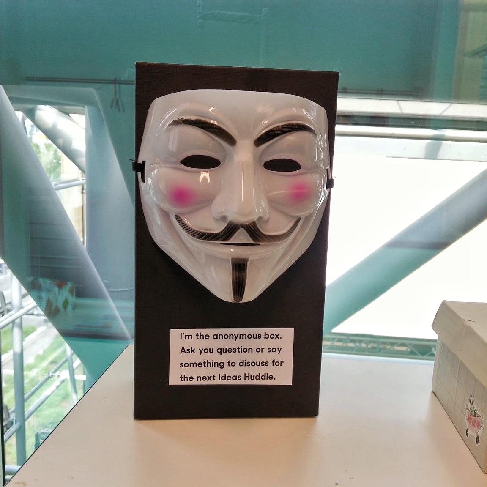
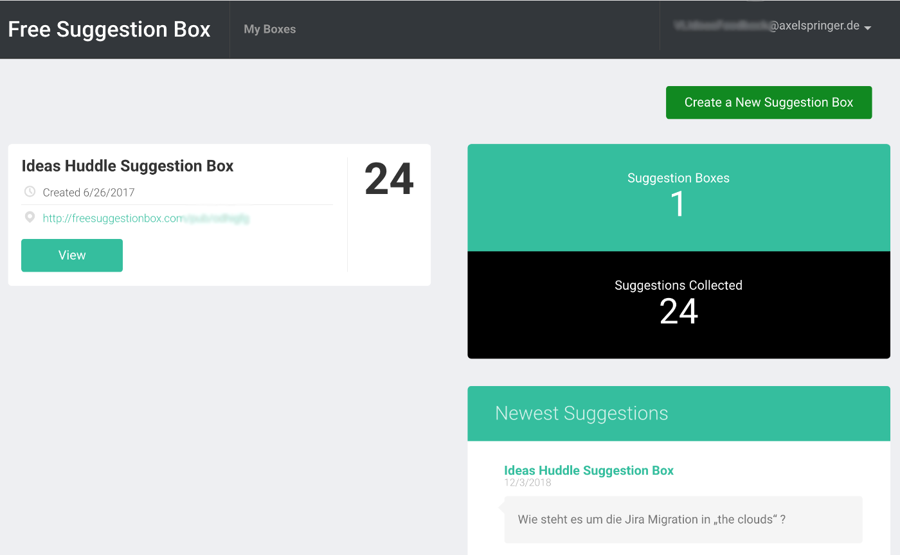

# 

We are legion.

# Also, wie geht das jetzt?

Digital, analog oder beides: Man braucht nicht viel. Und auch die meisten online Anbieter sind kostenlos.

Ein Box und ein anonymes Online-Formular. Ihr wolltet doch schon immer so richtig vom Leder ziehen und es wird vor allen vorgelesen – natürlich anonym.
* Man richtet eine anonyme online Umfrage ein, z.B. freesuggestionbox.com
* Zusätzlich baut man aus einem Schukarton eine Box um Zettel einzuwerfen
* Alle 2 Wochen werden die anonyme Fragen bei einem „Townhall“ bzw. “All-Hands“ (das gibt es doch hoffentlich bei euch mindestens alle zwei Wochen?! Ansonsten schaut weiter oben erstmal zum „Huddle“) vorgelesen
* Gemeinsam schaut man, ob das Thema einen Nerv trifft und ausführlicher behandelt werden sollte, sofort oder in einem anderen Format wie Fishbowl

# Butte bei die Fische: Das Rating

# Cultural Hacking

Dieser Hack ist Teil einer kleinen Serie, in der ich über unsere Cultural Hacks schreibe. Diese haben sich im Laufe der Zeit bei uns angesammelt! Im ersten Post "Kultur kann man nicht managen" bekommt ihr eine Übersicht, was Kultur bedeutet und wie man sie beeinflußen kann.

* [Kultur kann man nicht managen: Cultural Hacks zum selber Ausprobieren](https://axelspringerideas.de/blog/2018/11/cultural-hacking-101/)
* [Cultural Hack #1: Die Kudos-Box aus dem Schuhkarton](https://axelspringerideas.de/blog/2018/11/cultural-hack-no-1-kudos/)
* [Cultural Hack #2: Und wie geht's uns denn heute? Digitaler Niko-niko Kalender mit TeamMood.com](https://axelspringerideas.de/blog/2018/11/cultural-hack-no-2-niko-niko/)
* Cultural Hack #3: We are Legion: Anonyme Suggestion-Box
* Cultural Hack #4: Zeitmessung mit Lego: Was haben wir eigentlich die ganze Zeit gemacht?
* Cultural Hack #5: Team Budgets aka "Wir wollen einen Billiard-Tisch"
* Cultural Hack #6: Urlaubsplanung mal anders
* Cultural Hack #7: Lebenslanges Lernen? Dann aber bitte mit Bücherbudgets!
* Cultural Hack #8: Und was ist wenn er uns dann verlässt? Weiterbildungen für alle.
* Cultural Hack #9: No Coffee? No Worky! Belohnungen für Teams, nicht für Einzelne
* Cultural Hack #10: Tod den Meetingräume
* Cultural Hack #11: Ein bisschen Huddle - Inverses Reporting
* [Cultural Hack #12: Hacksite - Klassenfahrt mit Arbeitsbezug](https://axelspringerideas.de/blog/2018/11/hacksite/) von [(Macro Böttcher)](https://www.linkedin.com/in/marco-b%C3%B6ttcher-55a74324/)
* Cultural Hack #13: Anti-Hacks: Vom Shit-O-Meter bis Fuck Up Wand
