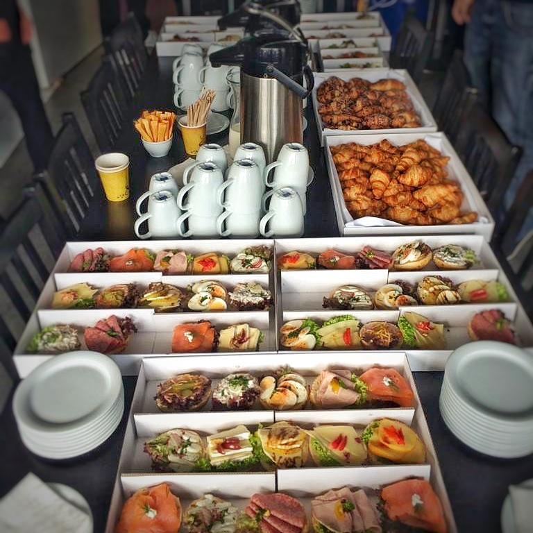
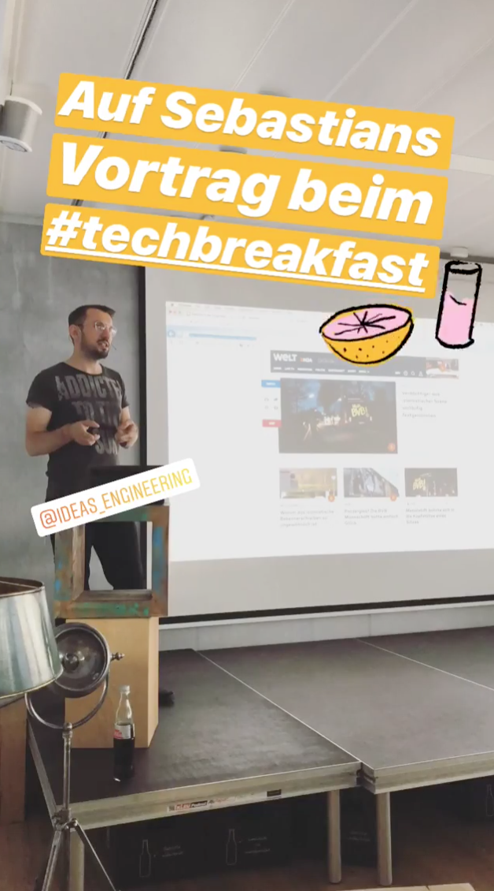

# How to organize a Brown Bag Session

Eine "Brown Bag Session" ist ganz klassisch eine Veranstaltung, bei der die Teilnehmer essen, während einer ein Thema vorstellt. Bei uns war dies halt ein Frühstück mit Kaffee, Brötchen und Croissants. Super zeitig am morgen um 9 Uhr oder später auch erst um 9.30 Uhr. Die Vorträge sind dabei zwischen 10 bis 15 Minuten lang und lieber kürzer und formloser. Power Point? Erzähl einfach! Oder stell uns dein Projekt und deinen Code vor. Das war damals unser Grundgedanke: Den Austausch fördern. 

Und woher kommt der Name "Brown Bag Session"? Das Mittagessen mit "brauner Tasche" bezog sich ursprünglich auf die Praxis von amerikanischen Arbeitern, die ein Mittagessen in einer braunen Tasche von zu Hause mitbringen. Und das dann zu einer informellen Lernmöglichkeit am Arbeitsplatz essen.

Wieso man das machen sollte? Nun, Lernen ist wichtig und wird in der heutigen Zeit immer wichtiger. Eine Brown Bag Session ist dabei sehr informell, die Einstiegshürde niedrig. Man kann also lernen, dabei netzwerken und sich mit Gleichgesinnten austauschen. Und der Vortragene teilt sein Wissen mit seine Kollegen. Wissensaustausch pur, in einer sicheren Umgebung, um seine Vortragsfähigkeiten zu verbessern.

# 

Was wir so seit 2013 alles gemacht haben und wie das so war, erfahrt ihr [hier in einem eigenen Blog-Post](https://axelspringerideas.de/blog/2019/01/tech-breakfast-est-2013/). Auch wenn das Format für uns sehr erfolgreich war, so war es auch oft ein Kampf, dass unser TechBreakfast am Leben bleibt. Wenn man nicht ständig daran arbeitet und gegensteuert, dann stirbt sowas sehr schnell. Es ist nie ein Selbstläufer (außer vielleicht ganz am Anfang).

# Kostenlose Tipps nach 6 Jahren TechBreakfast

#### Einfach anfangen
Am Anfang ist es egal, ob man eine Webseite hat, einen Newsletter oder sonst irgendwas. Wir haben einfach eine Auftaktveranstaltung gemacht und haben dort erklärt, was wir vorhaben und wie es funktioniert. Danach hatten wir eine Wiki/Confluence-Seite, auf der sich einfach jeder für einen Vortrag eintragen konnte. [Das sah dann so aus.](https://axelspringerideas.de/blog/2019/01/tech-breakfast-est-2013/) Einer unser Agile Coaches hat die Organisation des Essens übernommen. Also: Schnappt euch einfach einen hungrigen Kollegen, macht einen Termin, ladet alle ein und organisiert Frühstück.

#### Euphorie, Etablierung, Ernüchterung: Formate am Leben halten.
Es gibt immer eine anfängliche Euphorie, viele Vorträge, alle sind begeistert. Weil man es einfach tut, ohne lange nachzudenken. Mit fortschreitender Etablierung werden die Vorträge immer aufwendiger, aber dadurch auch schwieriger zu bekommen. Die Einstiegshürde wird höher. Wenn man nichts tut, stirbt so ein Format. Wie geht wie wir mit dem drohenden Tod um? Einerseits betrifft das die Organisatoren, die am Anfang mehr Energie haben, als auch das Format selbst, dass um Vorträge kämpfen muss. Hier hilft Abwechselung, Themen-Tage (z.B. Mobile/Cyber-Security/Cloud) bei denen man aktiver an die Themenauswahl geht. Und natürlich Verstärkung: Die Suche nach neuen Verbündeten. Vielleicht auch mal ein offenes Format, mit freien Vorträgen, ein Termin ohne Folien. Oder einen Ableger, wie bei uns NewInTech. Hier werden technische Themen für Non-Techies erklärt.

#### Verwendet einen offenen und neutralen Raum
Besser: Eine neutrale Fläche. Die im Idealfall frei zugänglich und sehr offen ist. So trauen sich die Leute eher dazu zu kommen. Wir hatten am Anfang das TechBreakfast in unseren Räumen. Auch wenn wir im gleichen Gebäude sitzen, wie ein paar andere Marken von Axel Springer, die wir eingeladen hatten, so haben die sich nicht wirklich zu uns getraut. Die Überwindung in eine andere Firma zu gehen ist hoch. Es wurde viel besser besucht von anderen Axel Springer Marken, als wir einen neutralen Raum im Erdgeschoss genutzt haben. Der war mietbar (ja, kostet etwas mehr als eigene Räume), aber komplett verglast und für alle zugänglich.

#### Macht die Teilnahme als Vortragener so einfach wie möglich
Wie erwähnt: Wir haben mit einer Wiki/Confluence-Seite angefangen. Später war eine ein freie und von jedem editierbares Google Sheets Seite. Am Anfang wollten wir zu den Vorträgen noch eine Beschreibung, worum es geht. Aber auch die haben wir für die Newsletter und den Kalender irgendwann selbst geschrieben. So wird die Einstiegshürde für Vortragene einfach niedriger. 

#### Überkommunikation!
Kommunikation gibt es nicht genug. Überkommunikation ist angesagt. Wenn ihr denkt, ihr kommuniziert auf genug Kanälen, dann ist es noch mindestens ein Kanal zu wenig. Die Ankündigungen sollten per Newsletter, per Social Media, per Messenger und über (digitale) Poster kommen. Macht Werbung! Wir haben über Mailchimp eine Newsletter, bei der die Ankündigungen und alle Informationen immer 3 Tage vorher raus gehen. Dazu einen großen Fernseher im Vortragsraum der nach außen zeigt, bei dem immer die nächsten Veranstaltungen angekündigt werden.

#### Macht ein paar eigene Vorträge als Inspiration
Es ist schwierig eine Richtung für Themen vorzugeben. Eigentlich will man so viele unterschiedliche Vorträge wie möglich. Abei die Leute kommen nicht auf die Idee, über bestimmte Themen zu sprechen, wenn ihnen niemand dabei hilft. Irgendwer muss die Richtung vorgeben, was alles für Vorträge möglich sein. Ein Vortrag über Bücher? Über Konferenzen? Über eigene Projekte oder Heim-Projekte? Oder Features einer neuen Version? Macht es einfach vor! Helft den Leuten, auch Ideen für tolle Themen zu Vorträgen zu kommen. Außerdem sind eigene Vorträge sind als Backup, wenn jemand sehr plötzlich ausfällt, immer sehr praktisch.

#### Erinnere die Leute ständig daran
Du hast letzte Woche daran erinnert, dass diese Woche TechBreakfast ist? Daran denkt doch keiner mehr! Ihr braucht mehr Vorträge, damit das Programm gefühlt ist? Dann müsst ihr ständig die Leute daran erinnern, wie und wo sie ihre Themen einreichen können. Auch hier gilt: Überkommunikation. Eine Woche vorher, 3 Tage vorher und 1 Tag vorher. Glaubt mir: Die Leute vergessen die Termine sonst verdammt schnell.

#### Kostenloser Kaffee und freie Snacks
Egal welche Veranstaltung ihr macht, zu egal welcher Zeit: Ihr braucht kostenlosen und genug Kaffee. Wir hatten am Anfang auch Angst, dass Leute nur wegen dem Frühstück kommen und bei den Vorträgen wieder gehen. Diese Angst war total unbegründet! Wer kommt, der bleibt für die Vorträge. Das kostenlose Frühstück ist nur ein angenehmer Bonus.

#### Zeit ist immer ein Problem
Machen wir uns nichts vor: Neben der täglichen Arbeit noch einen Vortrag ausarbeiten dankt einem niemand. Und auch bei den Zuschauern ist Zeit ein knappes Gut: Sich eine Stunde vom Tag regelmäßig Zeit nehmen und zu einem Vortrag gehen macht auch nicht jeder. Deswegen sollte man die Zeit von Vortragenen und von den Zuschauern immer respektieren.

#### Keine. Redner. Von. Externen. Firmen.
Nichts macht eine tolle Veranstaltung so schnell kaputt, wie eine schlechter Vortrag einer externen Firma. Ein Vortragener von MongoDB? Einer von Salesforce? AWS?! Vergesst es! Das sind Verkaufsveranstaltungen. Egal was die euch vorher versprecht - lasst es sein. Die Vorträge sollten nur von internen Kollegen kommen. Für externe Redner solltet ihr eigene Termine und eigene Formate aufsetzen.

# 

# Kurz und knapp: Und was haben wir sonst so dabei gelernt?

* Wenn du Leuten sagst, sie sollen eine Zusammenfassung für ihren Vortrag schreiben (z.B. für eine Newsletter), dann bekommst du im Normalfall den Titel des Vortrages mit einem zusätzlichen Verb. Sei konkreter, was du brauchst, oder schreib selbst einen Teaser.
* Mach dir nichts vor: Die Organisation ist aufwendig. Das TechBreakfast über so lange Zeit am Laufen zu halten kostet viel Energie und individuellen Einsatz. Nebenbei so etwas zu organisieren und am Leben halten geht nicht.
* Die meisten Leute wollen keine Vorträge halten, weil es für sie ungewohnt und Stress ist. Man muss ihnen deswegen eine sichere Umgebung schaffen und immer überzeugen, wieso es sinnvoll ist, Vorträge zu halten.
* Wenn jemand sagt, er wäre bereit einen Vortrag zu halten, sollte man trotzdem weiter dabei unterstützen, dass sie den Vortrag auch eintragen und halten. Hier hilft es, direkt konkret den Termin einzutragen und in einer Newsletter zu erwähnen.
* Nach fest kommt ab: Nervt die Leute nicht, dass sie einen Vortrag halten sollen. Fragen ist okay, aber wenn jemand nicht will, dann will er nicht. Auch wenn du denkst, dass er einen tollen Vortrag halten würde! Es ist ihre Entscheidung.
* Irgendwann kommt immer der Zeitpunkt, wo etwas abflacht. Hier hilft frische Energie und neue Mitstreiter!
* Nach einer Weile kann man sich auch einen externen Sponsor suchen - bei uns war es unsere zentrale HR Abteilung bei Axel Springer namens "People & Culture".

