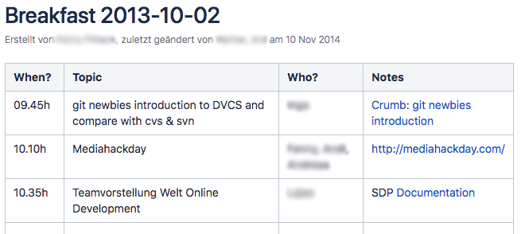
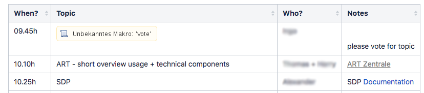
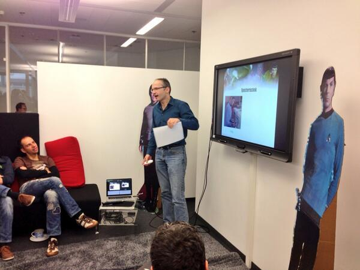
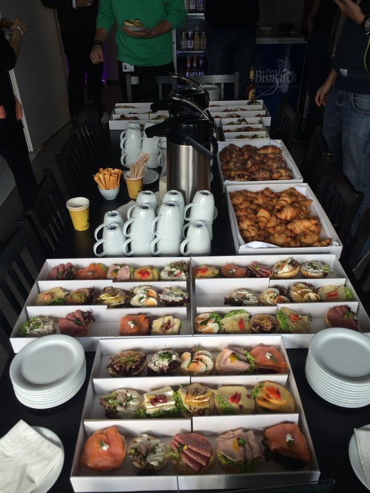
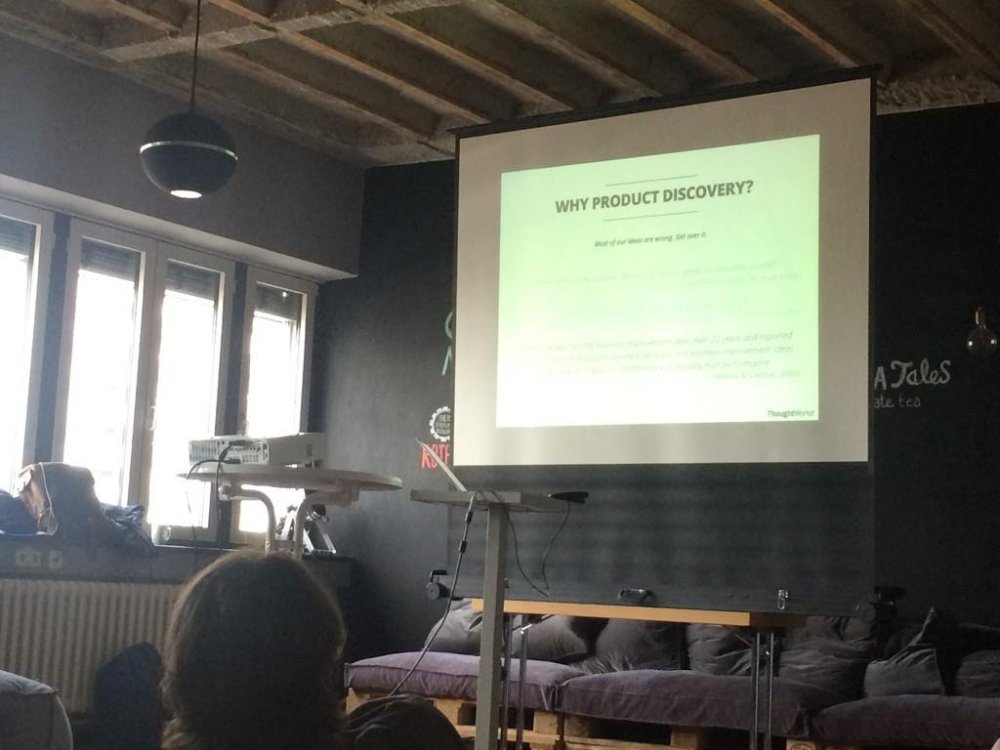
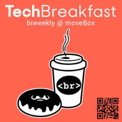
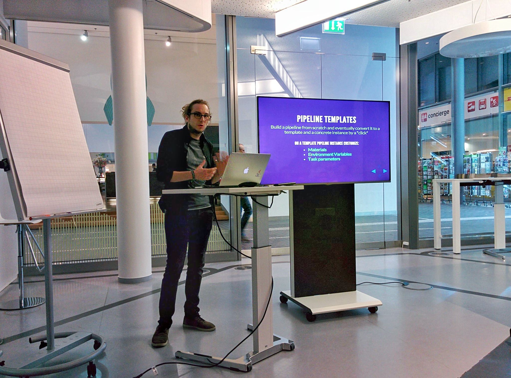
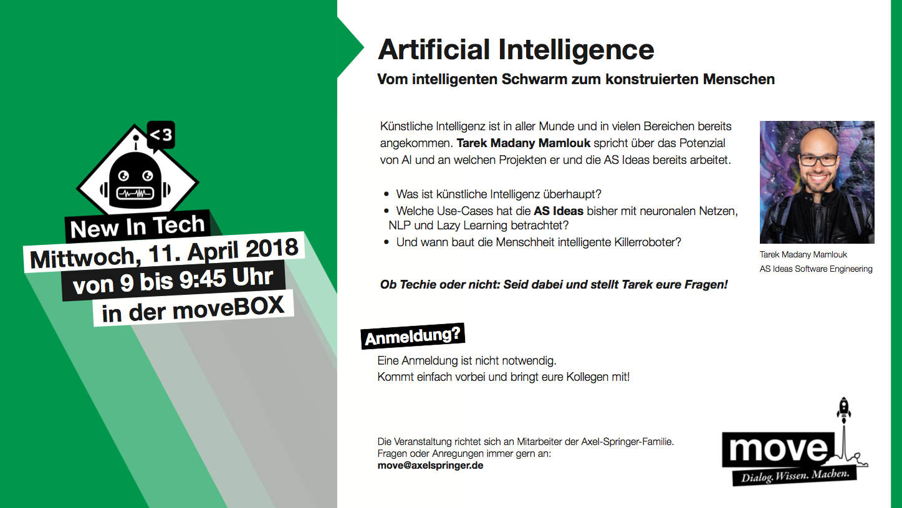

# 
# Techbreakfast est. 2013: Eine Geschichte von vielen Croissants

Als wir 2013 gegründet wurden, hatten wir den Anspruch eine von Entwicklern geführte Firma zu sein. Technische Exzellenz und moderne Technologie hat für uns daher immer dazu gehört. Aber wie verankert man das in seiner Kultur und wie bleibt man offen für neue Technologie? Eine Antwort für uns war die Gründung des "OpenTechBreakfast" als Ort des offenen Austausches. Eine [Brown-Bag-Session](https://de.wikipedia.org/wiki/Brownbag) mal anders! 
 
Aber ist das etwas für Entwickler? Vorträge halten, sozial sein, nicht am Rechner sitzen? Wie sich gezeigt hat: Ja! Denn seit fast 6 Jahren ist dieses Format für uns extrem erfolgreich. Sich mit Kollegen und Kolleginnen darüber austauschen, was sie in der Welt der Technologie beschäftigt, oder die coolsten Projekte vorzustellen. Das trifft einfach einen Nerv. Deswegen hier eine kurze Geschichte und viele Bildern aus mehreren Jahren TechBreakfast.

Was wir bei der Organisation und dem Durchführen gelernt haben, erfahrt ihr [hier in einem extra Blog-Post](https://axelspringerideas.de/blog/2019/01/how-to-organize-a-tech-breakfast/).

## 2013: Was ist eigentlich eine Brown-Bag-Session oder ein Learning Lunch? 

Eine Brown-Bag-Session ist ganz klassisch eine Veranstaltung, bei der die Teilnehmer essen, während ein ein Thema vorgestellt wird. Bei uns war dies halt ein Frühstück mit Kaffee, Brötchen und Croissants. Super zeitig am Morgen um 9 Uhr oder später auch erst um 9.30 Uhr. Die Vorträge sind dabei zwischen 10 bis 15 Minuten lang und lieber kürzer und formloser. Power Point? Erzähl einfach! Oder stell uns dein Projekt und deinen Code vor. Das war damals unser Grundgedanke: Den Austausch fördern.

Deswegen war auch das Anmelden von Vorträgen immer unkompliziert: Auf einer Wiki-Seite hat sich einfach jeder eingetragen, der etwa zu einem Thema vorstellen wollte. Das Ganze sah dann so aus:

Insgesamt 12 Mal gab es das OpenTechBreakfast im Jahr 2013, in einer Sofa-Ecke, in der etwas Platz war. Hier eine Auswahl der Themen:
 
* 25.09.2013: Introduction meeting format
* 02.10.2013: Git for newbies, Vorstellung Mediahackday, Teamvorstellung Welt Online Dev
* 09.10.2013: ART, SDP
* 16.10.2013: Media Hackday Result Presentation, REM
* 23.10.2013: Immutable Infrastructure, Provisioning with Chef
* 30.10.2013: cssConf, Design Thinking, Rebell
* 13.11.2013: Varnish and Varnish Day at Axel Springer HQ, Community of Practice @ideAS, How to get rid of expensive Backend developers 
* 20.11.2013: Core Media Ops and Dev, ideAS Ventures - Was ist das?, Kommunikationstest
* 27.11.2013: Digitales Mentoring, Technische Visionen bei Star Trek und deren Umsetzung
* 04.12.2013: Calabash - Mobile Art, Wissensdynamic in cross functional teams
* 11.12.2013: StarFish, Impact Mapping, Das Celepedia Backend - Die ersten 4 Monate
* 18.12.2013: Design at Celepedia, Swagger

## 2014: Und wöchentlich grüßt der Kaffee

Ein großartiges Jahr für das TechBreakfast: Insgesamt 41 Mal fand es statt! Das war quasi wöchentlich, bis auf einige Ausfälle. Da auch die Anzahl der Zuschauer gewachsen ist, wurde es immer öfters in einen großen Raum im Axel Springer Unternehmerclub verlegt. Dafür musste man zwar das Gebäude wechseln, aber dafür war es als neutraler Raum auch für alle besser zugänglich. Nicht nur für unsere Mitarbeiter, sondern auch für Kollegen von anderen Axel Springer Marken. 

Hier eine kleine Auswahl der Themen: 
* Why do we need "Frontend Devops"??
* Women in Media
* New Relic
* Go in a nutshell
* Continuous Performance Management
* Rapid Prototyping with Spring Boot
* Event Tracking mit Logstash + ElasticSearch + Kibana
* Agile Metrics

Die komplette Liste wird viel zu lang! Denn es waren über 100 Vorträge, die wir hatten. Auch ich hatte hier meinen ersten Vortrag in meiner professionellen Karriere: "IntelliJ IDEA Version 14 - Was ist neu?". Und der war genau so, wie ein guter Vortrag sein sollte: Ohne Folien. Denn dadurch ist die Vorbereitungszeit viel gering. Denn die Einstiegshürde sollte bei uns immer sehr niedrig sein, damit sich alle trauen, einen Vortrag zu halten.

## 2015: Es wird größer: OpenTechBreakfast wird zum TechBreakfast

Wir als Ideas Engineering wurden immer kleiner (und später auch manchmal wieder größer), da einige unserer Teams an erfolgreichen Projekten gearbeitet haben, die dann ausgegründet wurden. Das hatte auch zu Folge, dass nicht mehr nur Ideas Engineering das TechBreakfast organisieren konnte und wollte, sondern es eine Kooperation mit anderen Axel Springer Marken wurde.

# 

Und so wurde aus dem "OpenTechBreakfast" nur noch das "TechBreakfast", vorrangig organisiert zusammen mit den Kollegen von Welt und Bild. Insgesamt gab es 30 Veranstaltungen im Jahr 2015. Mit zwei oder drei Vorträgen pro Veranstaltung.

* Ein Bericht aus dem Silicon Valley
* REST with RAML
* Datadog 
* Bericht von der FOSDEM
* JavaScript auf Server-Seite
* Acceptance Test-Driven Development (ATDD
* Web-Typographie
* Master the Art of CSS Fu – Part 1: How to write CSS Selectors
* How to become a better developer (without coding)

## 2016: Professionalisierung als Verlust?

Ab 2016 haben wir das TechBreakfast 24 Mal veranstaltet. Was wirklich spannend ist: Die Qualität der Vorträge hat sich geändert. Insgesamt sind die Vorträge länger (20-30min) und professioneller geworden. Einige der Vorträge waren so gut, die könnte man auf verschiedenen Konferenzen halten. Ein großartiges Jahr. Hier eine Auswahl der Themen:

* Varnish@BILD
* H/2 - die neue Kuh im Dorf
* VIPER - Our Experience
* Tmux(P) in Action
* Kubernetes
* Domain-Driven-Design
* CSS-Grids
* Kotlin
* Optimierung einer Ente !!!
* DevOpsCon Recap
* Pipeline-as-code mit Jenkinsfiles
* What’s new on iOS, tvOS, watchOS, macOS

Und der Nachteil? Die Einstiegshürde ist höher geworden. Niemand hält mehr Vorträge ohne Folien. Längere Vorträge bedeutet auch mehr Arbeit in der Vorbereitung. Gerade auch ab Ende 2016 merkt man, dass die Anzahl der Vortäge sinkt.

# 2017: Eine kleine Flaute

Die hohe Qualität der Vorträge im Jahr 2016 hatte auch einen Nachteil: Es war schwieriger, Leute als Vortragende zu gewinnen. Die Messlatte war sehr hoch und damit auch die extra Arbeit für die Kollegen. Dazu war nach 4 Jahren Organisation auch etwas die Luft raus. Denn die Organisation erfordert viel Energie. Und so gab es das TechBreakfast nur noch monatlich, da zu viele Veranstaltungen ausgefallen sind, da es keine Vorträge gab. Dafür haben wir uns dann aber Unterstützung von unserem internen Personalbereich "People & Culture" geholt, die uns seitdem bei der Organisation unterstützen (und den Raum und das Frühstück zahlen ;) ).

Der Anspruch war am Anfang spontane, kurze Vorträge, niedrigschwellig. Die aktuelle hohe Qualität sorgt also im Jahr 2017 für Schmerzen. Wie schafft man es also, dass man wieder mehr Energie in das Format bekommen?

Insgesamt also ein eher schwächeres Jahr, dafür aber trotzdem mit einigen tollen Themen:

* Swagger und was es davor gab
* Leveling up your React-App: Manage your State with Redux
* Lasttests mit Gatling
* Live Templates in IntelliJ

# 2018: NewInTech als zusätzliches Format

Auch im Jahr 2018 gab es das TechBreakfast insgesamt 12x und damit monatlich. Dafür gibt es aber noch ein zusätzliches Format, das frischen Wind gebracht hat: NewInTech.

Beim **NewInTech** geht es um Vorträge zu technischen Themen, aber für Leute, die neu in diesem Bereich sind. Also Tech erklärt für Non-Techies. Hier sind die Vorträge länger (30-60min) und die Menge an Zuschauern ist unglaublich. Es war immer richtig richtig voll.

* Trends im Digital Advertising
* AWS und die Cloud
* Blockchain oder die langsamste Datenbank des Internets
* Artificial Intelligence
* Agile Demystified
* Silicon Valley Reise
* Cybercrime Mythen

# 2019: Status Quo?

Auch in diesem Jahr werden wir das TechBreakfast mindestens monatlich veranstalten. In diesem Jahr wollen vor allem die Organisation ändern, damit wir mehr Vorträge bekommen und ein volles Programm haben. Zuschauer und Nachfrage gibt es weiterhin mehr als genug!

