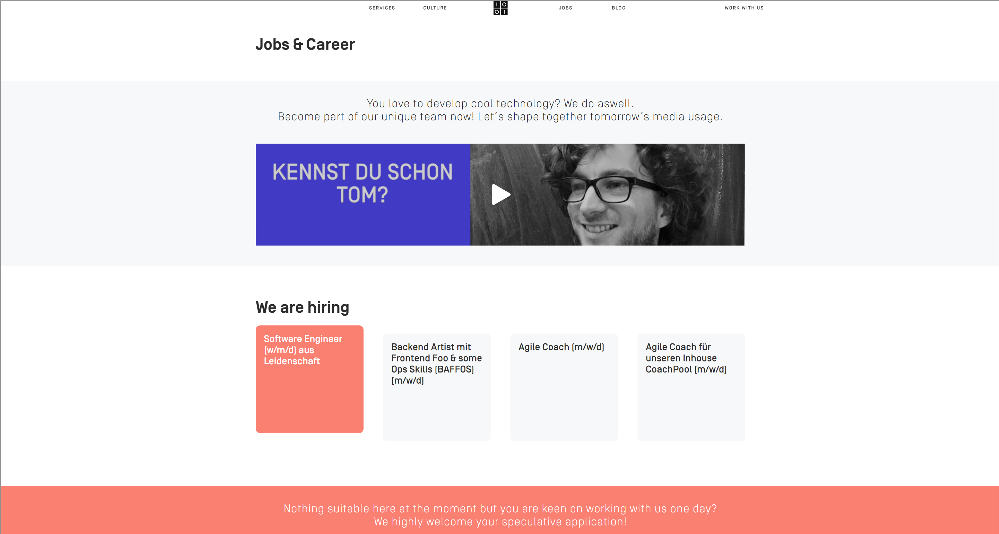
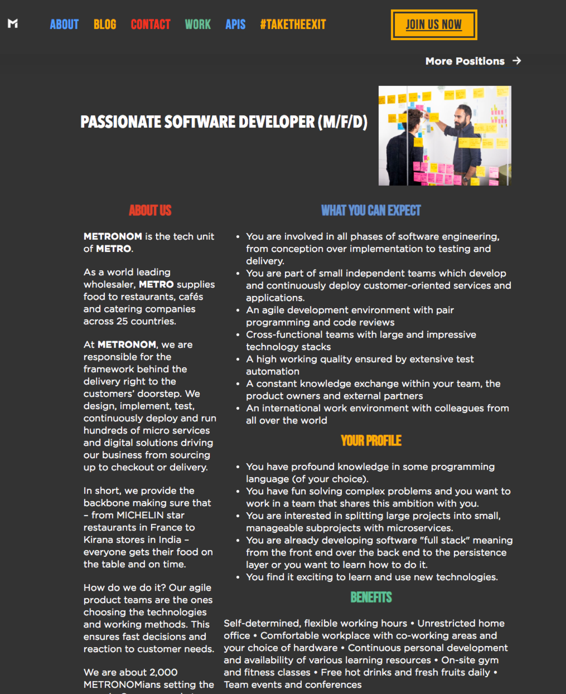
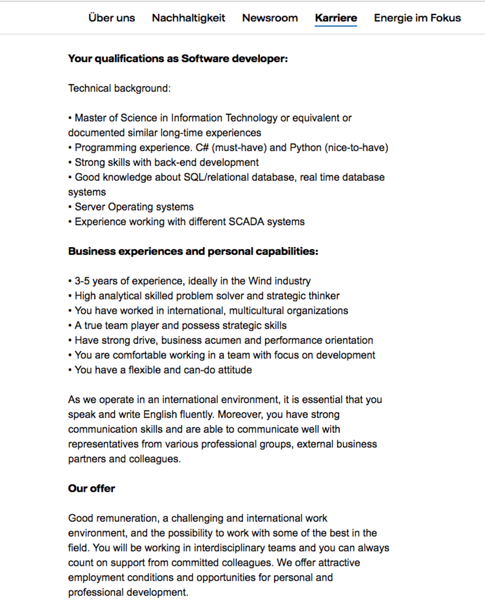

# Gute Stellenausschreibungen, Schlechte Stellenausschreibungen

New Work und Arbeit 4.0 verändern nicht nur die Art und Weise wie wir arbeiten, sondern auch wie Recruiting funktioniert und was die Spielregeln sind. Und das fängt bereits bei den Stellenausschreibungen an. Gerade im IT-Bereich kann sich keine Firma mehr leisten, auch nur auf einen Bewerber zu verzichten. Und wie schreibt man jetzt zeitgemäße Stellenausschreibungen?

*Fangen wir mit einer Hypothese an:* Früher war man als Job-Suchender fast schon ein Bittsteller, der sich erstmal beweisen muss. Die Firma bekommt so oder so dutzende Bewerbungen und kann sich den oder die Beste/n aussuchen. Mit der Stellenanzeige hat man deswegen bereits vorgefilter. Diese Zeiten sind vorbei! Heute suchen sich Bewerber aus, wo sie arbeiten wollen.

Das bedeutet aber nicht, dass man weniger Wert auf die Qualität und den kulturellen Fit eines Bewerbers legen sollte: Schlechte Entwickler einstellen ist wie das Trinken von Salzwasser. Man denkt man löscht den Durst, dabei wird er nur schlimmer! Auch ist es ein Zeichen von Qualitätsbewußtsein und das wirkt positiv auf den richtigen Bewerber. [Ich würde schließlich auch nie für eine Firma arbeiten, die keine Code-Tests macht.](https://axelspringerideas.de/blog/2018/07/talk-is-cheap-show-me-your-code/)

## Früher waren Stellenausschreibungen Filter, heute sind sie Marketing-Material

Und das bedeutet: Als Recruiter ist man nicht nur Einkäufer, sondern auch Verkäufer. Man muss zeigen, dass man der richtige Arbeitgeber ist. Und das fängt bereits bei der Stellenausschreibung an - man präsentiert sich hier als Firma. Und macht dem Kandidaten klar, wieso es für ihn ideal wäre, für einen zu arbeiten. Wieso er zu einem passt.

Damit ändert sich auch grundlegend, was in eine Stellenausschreibung kommt und was nicht. Das Ziel ist es, attraktiv und zeitgemäß zu wirken und möglichst viele (gute und passende) Bewerbungen zu bekommen. Es dreht sich also um, vom klassischen "das musst du können und mitbringen", das ist "dein Profil" hin zu: Das sind wir als Firma, so wirst du bei uns arbeiten und deswegen ist es toll mit und für uns zu arbeiten. Die Stellenausschreibung steht Kopf!

## Ein paar grundlegende Tipps, wie man Bewerbungen schreibt

**Pareto-Effizienz**: Das Pareto-Prinzip kennen viele, die Pareto-Effizienz aber nicht. Eine Ausschreibungen sollte nur Begriffe enthalten, die für jeden Kandidaten entweder neutral sind, oder positiv aufgenommen werden. Mich zum Beispiel schrecken Bezeichnungen wie “Junior” oder “Senior” ab. Ich kenne Leute, die mögen den Begriff “Backend-Entwickler” nicht, da sie sich nicht so einfach in Schubladen stecken wollen. Seien wir ehrlich: Im Laufe einer Karriere machen Leute viele verschiedene Tätigkeiten. Es geht eher um ihre Motivation etwas zu machen, nicht um die Schublade.

**Nicht zu viele, nicht zu spezialisierte**: Eine von unseren Axel Springer Marken hatte 40 Stellen zu besetzen, aber 70 Stellenausschreibungen auf der Webseite. Weniger ist mehr! Sucht ihr einen “Senior Developer” und einen “Junior Developer”? Reicht nicht dafür ein Profil, da jeder Bewerber sowieso individuell ist? Und muss es wirklich ein Profil für einen “Senior PHP Entwickler mit Erfahrung mit Zend 2.0 und Oxid 5” sein?

**Fang mit dem Warum an**: Du versuchst dich als Arbeitgeber zu verkaufen, also fang in der Ausschreibung damit an, warum jemand gerade für dich arbeiten sollte. Was kannst du einmaliges bieten, was kann jemand bei dir bewegen? Stell dich als Firma vor und mach dem Kandidaten klar, wieso er sich genau hier bewerben sollte. Was macht dich besonders?

**Dreh die klassische Stellenanzeige auf den Kopf**: Der typische Aufbau ist etwas wie "Deine Herausforderungen", ""Dein Profil" und ganz unten und ziemlich klein "Was wir bieten". Dabei gehört das genau anders herum - oben sollte stehen, was man als Firma zu bieten hat, unten kommt dann, wie und woran man arbeitet. Und nicht wie früher 2/3 der Anzeige was der Bewerber alles können muss und was sein Profil ist.

## Ein gutes Beispiel

Dieses Beispiel ist von [Metronom](https://www.metronom.com/position/passionate-software-developer) und ein sehr schönes Beispiel für eine gelungene Stellenausschreibung. Diese Stellenausschreibung (von Anfang 2018, also über 12 Monate alt) hat mich zu diesem Artikel inspiriert - denn hier ist mir klar geworden, was für mich eine gute Stellenausschreibung ausmacht.

# 

## Ein nicht so gutes Beispiel

Eine typische Stellenausschreibung, wie man sie vor einigen Jahren bei jeder Firma gefunden hat - dieses Mal von einem großen Energie-Anbieter aus Schweden. Vor dem Screenshot war noch ein mindestens nochmal so langer Text, wieso die Firma toll ist. Das war aber so inhaltslos, dass ich davon keinen Screenshot gemacht habe. Diese Stellenausschreibung fällt heute durch, eigentlich kann ich fast alles daran kritisieren. Ich entschuldige mich vorab für das folgende Bashing!

# 

* Ein langer Text mit der Beschreibung der Firma am Anfang - genau so lang wie der Rest des Stellenausschreibung, leider ohne viel Inhalt (nicht auf dem Screenshot).
* Man beginnt nicht mit den "Anforderungen" - man macht es umgedreht. Was bietet mir die Firma? Hier sollte beschrieben werden, wie der Job aussieht und was man dort machen wird.
* Und wo steht eigentlich, woran und wie man später arbeiten wird?
* 80% Anforderungen und nur 20% "Benefits"? Come on!
* Scheiß auf Hochschulabschlüsse - einer der beste Entwickler die ich kenne hat Musiktheorie studiert.
* C# und Python? Immerhin haben sie keine Jahre angegeben. Ich denke, ein Java/Kotlin/Swift-Entwickler wird in C# auch ziemlich schnell rein kommen. Es ist OK zu beschreiben woran und womit man später arbeiten wird, aber es geht viel mehr um die Motivation des Bewerbers. Motivation und Charakter muss man haben, Fähigkeiten/Skills kann man lernen. 
* 3-5 Jahre Erfahrung? Man kann auch 10 Jahre in Folge jedes Jahr die gleiche Erfahrung machen. Man kann auch nach einem Jahr schon unglaublich gut sein.
* Bullshit-Bingo: Team player, analytical skilled problem solver, strategic thinker, performance orientation
* Gute Vergütung? Wirklich? Das ist aber nett von euch.

## Please, no more! Fünf Dinge, die ihr vergessen solltet

Diese 5 Dos and Don’ts habe ich von [Ivo Betke](https://www.linkedin.com/in/ibetke/) gelernt und übernommen und versuche sie einfach mit meinen Worten auszudrücken.

# 

**Vergiss Perks**: Keiner wird in deiner Firma anfangen, weil ihr Obst, Club Mate oder einen Kicker hab. Die Leute wollen Verantwortung übernehmen und sinnhafte, selbstbestimmte Arbeit machen. Bestimmte Dinge werden in der IT vorausgesetzt und sind damit Hygienefaktoren. Es ist ok echte Benefits zu erwähnen, um seine Kultur darzustellen, wie z.B. freie Hardware und Software Wahl.

**Vergiss Studienabschlüsse**: Einige der besten Entwickler die ich kenne haben Musiktheorie oder Chinesisch studiert. Oder haben "nur" eine Ausbildung. Es ist typisch Deutsch eher auf Zertifikate zu achten, als auf die Fähigkeiten. Deswegen sollte man auch unbedingt eine [Arbeitsprobe wie eine Coding Challenge](https://axelspringerideas.de/blog/2018/07/talk-is-cheap-show-me-your-code/) machen, um Leuten mit ungewöhnlichen CVs eine Chance zu geben.

**Vergiss Bullshit**: Was einige in Ausschreibungen steht klingt manchmal so, als macht sich da jemand über irgendwas lustig. Was ist denn ein agiler & innovativer Mitarbeiter? Eigentlich gehören zu dem Bullshit-Bingo auch die anderen Klassiker: Teamfähig, leistungsorientiert, hohe Innovationskraft, praxisnah, Branchenübliche Bezahlung, spannendes Arbeitsumfeld. Das lässt Zweifel an der Kompetenz der Unternehmen aufkommen und vermittelt garantiert kein vertrauenserweckendens Bild!

**Vergiss Zahlen**: 5 Jahre Berufserfahrung, 3 Jahre mit Java gearbeitet? Man kann auch jedes Jahr die gleichen Erfahrungen machen! Es gibt Leute, die sind nach einem Jahr bereits besser in einer Tätigkeit, also jemand mit 20 Jahren Erfahrung. Unglaublich, aber wahr. 

**Vergiss Frameworks und Programmiersprachen**: Du suchst jemanden mit Erfahrung speziell mit dem Zend-Framework und am besten muss es PostgreSQL als Datenbank sein. Ich verrate euch ein Geheimnis: Es kommt auf den Charakter und die Motivation nicht. Denn Fähigkeiten kann man schnell lernen. Wenn jemand Bock auf ein bestimmtes Thema hat, wird er sich sehr schnell einarbeiten. Es ist also wichtiger dem Bewerber zu erklären, mit welchen Mitteln (z.B. die Programmiersprache und der verwendete Tech Stack) er später im Team arbeiten wird, aber setze es nicht als Bedingung voraus.

## TL;DR: DO IT! Fünf Dinge die du machen solltest

# 

**Werde persönlich**: Weg mit dem weichgewaschenen PR-Floskeln! Zeige lieber offen und ehrlich, wer du bist und wie du arbeitest. Wie sieht das zukünftige Team aus, was kann sich der Bewerber vorstellen?

**Werde konkret**: Ein "spannendes Arbeitsumfeld" sagt genau: Nichts. Erkläre lieber, wie und woran und mit welchen Technologien man arbeiten wird. Zeige Beispiele aus der Vergangenheit. Gib konkrete Aussage und sei transparent!

**Werde vorausschauend**: Menschen haben das Bedürfnis sich zu entwickeln. Es ist besser zu zeigen, wie man sich in den nächsten Jahren persönlich in einer Rolle entwickeln kann, als "ein sicherer Arbeitsplatz". Zeigt eure Karriere- oder Weiterbildungsmöglichkeiten. Beispielsweise dass man das AWS-Zertifikat bezahlt oder wie man jemanden mit Coachings in der Entwicklung unterstützt.

**Werde flexibel**: Unglaublich, aber wahr: Ein fester Job mit fixem Gehalt und 40h pro Woche 9-to-5 ist heute nicht mehr der Traum der meisten Arbeitnehmer. Teilzeit? Ja klar! Flexible Arbeitsorte, nur 4 Tage pro Woche, Elternzeit, angepasste Gehälter? All das sollte kein Problem, sondern Standard sein. Jeder Mensch ist individuell, jeder Job sollte es auch sein.

**Werde ein Verkäufer**: Du bist nicht nur auf der Suche nach einem neuen Kollegen, du musst auch deine Firma verkaufen! Das gilt sogar schon für die Übersicht eurer offenen Jobs - wenn die jemand sieht, ergibt das ein rundes Bild? 

## Recruitment in Zeiten von New Work?

Was denkt ihr, wie moderne Stellenanzeigen aufgebaut sein sollten? Schreibt mir gerne eure Meinung! Hier dann noch zwei Blog-Posts zum Thema Recruiting:

* [Wie wir bei Ideas Engineering rekrutieren](https://axelspringerideas.de/blog/2018/05/wie-machen-wir-bei-ideas-engineering-eigentlich-recruiting/)
* [Talk is cheap, show me your code](https://axelspringerideas.de/blog/2018/07/talk-is-cheap-show-me-your-code/)
